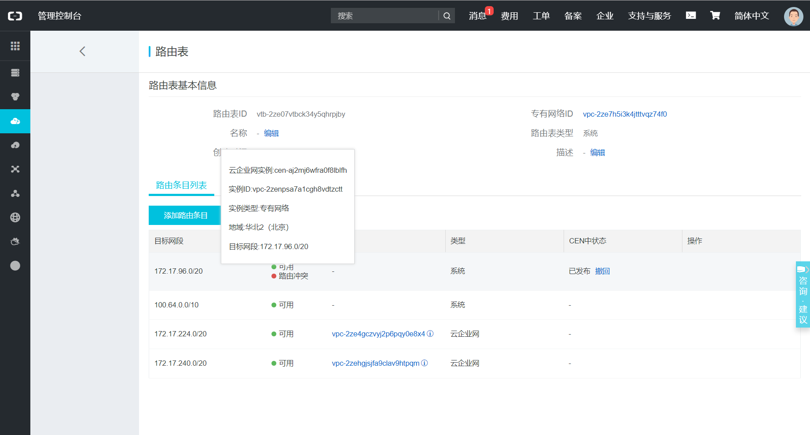

# 阿里云虚拟机集群设置

笔者尝试了如下两种方案，主要目的是搭建4台内网互通的节点，并尽可能省钱。

## 目录

- [一个账号4个ECS](#1)
- [4个学生机账号](#2)
- [错误与调试](#3)

## <p id=1>一个账号4个ECS

在一个账号下申请4个突发性能实例是比较实惠的方案，配置过程如下。

### 按需购买服务器


### 添加到同一安全组


### 购买并绑定公网ip


### 设置密码


别忘了在控制台中重启所有的服务器。

### 使用ssh连接

```
PS C:\Users\XGM> ssh root@39.104.27.119
The authenticity of host '39.104.27.119 (39.104.27.119)' can't be established.
ECDSA key fingerprint is SHA256:I9TItgv8yKGcxxtyiDB6gB3brd2xmphyl7Gc/1lBrus.
Are you sure you want to continue connecting (yes/no)? yes
Warning: Permanently added '39.104.27.119' (ECDSA) to the list of known hosts.
root@39.104.27.119's password:
Welcome to Ubuntu 16.04.4 LTS (GNU/Linux 4.4.0-117-generic x86_64)

 * Documentation:  https://help.ubuntu.com
 * Management:     https://landscape.canonical.com
 * Support:        https://ubuntu.com/advantage

Welcome to Alibaba Cloud Elastic Compute Service !

root@iZhp3bm132kqe3mj9urjcyZ:~#
```

到这里，我们能够使用ssh访问节点，现在可以关掉浏览器，进入下一环节。


## <p id=2>4个学生机账号

### 购买

这里首先要申请4台学生机，详情可见阿里云[云翼计划](https://promotion.aliyun.com/ntms/act/campus2018.html)。**特别注意**，在购买界面一定要选择`云服务器ECS`，不能选择“轻量应用服务器”，因为后者不能实现内网互通，导致后面集群搭建失败。同样注意选择4台学生机的地域选择要一样。如下。


### 添加云企业网

这里比较麻烦，需要把我们申请的4个账号下同地域的4台学生机进行内网互联。进入阿里云的管理控制台，我们可以看到申请的实例网络类型是`专有网络`，这个类型的网络不能通过配置安全组进行内网互通。因此我们需要搭建`云企业网`进行内网互通，同地域网络实例互通免费，无需购买带宽包。

可以参考阿里云的[云企业网搭建教程](https://help.aliyun.com/document_detail/65901.html?spm=a2c4g.11186623.6.558.32b14c97WBdLP9)

首先在master账号下进入云企业网并点击创建云企业实例，如下图。


然后在slave1账号下进入专有网络VPC，并对刚刚新建的云企业网进行授权操作，授权对象是master的账号ID。


回到master账号，点击`加载网络实例`，添加slave1-3的实例ID进入云企业网即可。


使用ssh随意进入一台机器并ping另外的机器，检测是否成功互联。


### 配置安全组访问

在控制台的安全组下，添加安全组之间互相访问以及开启外网访问。

首先开启跨账号安全组访问，


接着开启外网访问


最终配置如下，需要对每一台节点进行这样的配置，比较麻烦。


如果使用windows，将申请到的公网ip加入`C:\Windows\System32\drivers\etc\hosts`即可实现快捷访问
```
47.94.XX.XX master
39.96.XX.XX slave1
39.96.XX.XX slave2
39.96.XX.XX slave3
```


## <p id=3>错误与调试

这里，笔者遇到了一个活久见的问题...路由表冲突。具体表现为，master与slave1不能互通，slave1~3之间能够互通，且master与slave2、slave3也能互通。笔者查询云企业网的路由表，发现了错误所在：*master路由表和slave1路由表冲突，目标网段都是172.17.96.0/20*。如下图。



经过咨询阿里云工程师，得到解决办法。如下
```
 工程师 6XXXX 号 :    您好，您master的交换机的网段是172.17.96.0/20 ，查看与slave节点中的网段是冲突的，您只需要更改下您master节点的交换机，更改为不与其他三个slave节点交换机冲突的网段就行，比如您slave 是172.17.1.0/24,2.0/24，您master就使用3.0/24，不能使用与slave 相同的网段或者有重叠的网段

master的vpc下重新建一个交换机，然后更改下master的交换机就行了，更换交换机指南请参考：https://help.aliyun.com/document_detail/27733.html?spm=5176.11065259.1996646101.searchclickresult.2cb13816I4Z2nv  
```
具体做法如下图。


然后**停止实例**，如下图点击修改私有ip，改绑交换机，重绑云企业网的实例，重启master和slave即可ping通。


记得有问题，问阿里。