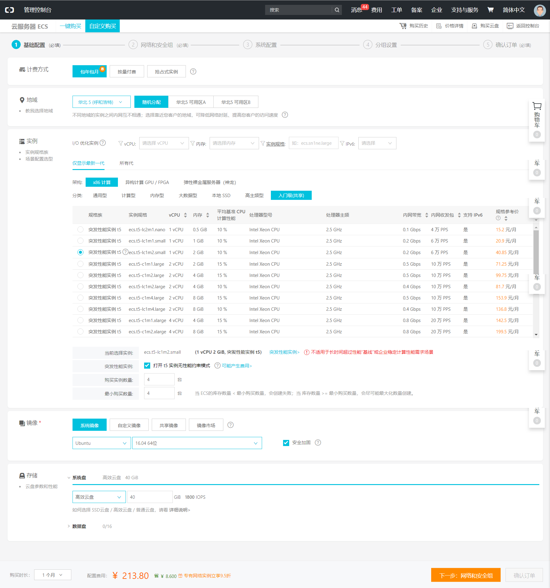
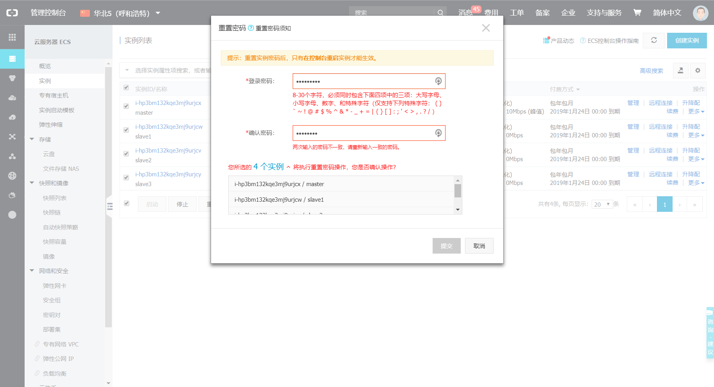

# Hadoop3分布式+Hadoop Streaming环境搭建 

本文完全从0开始搭建基于阿里云ESC的全分布式集群。


## 目录

- [购买并配置阿里云](#1)  
- [配置host相关文件](#2)  
- [配置节点之间免密SSH登陆](#3)  
- [配置JAVA](#4)  
- [配置vim缩进](#5)   
- [下载解压Hadoop3.1.1](#6)  
- [配置Hadoop环境变量](#7)  
- [配置hadoop3.1.1设置文件](#8)  
- [使用Hadoop Streaming](#9)  
- [错误分析以及调试](#10)  
- [鸣谢](#11)  
- [后记](#12)  


## <p id='1'>购买并配置阿里云


### 按需购买服务器



### 添加到同一安全组


### 购买并绑定公网ip


### 设置密码



别忘了在控制台中重启所有的服务器。

### 使用ssh连接

```
PS C:\Users\XGM> ssh root@39.104.27.119
The authenticity of host '39.104.27.119 (39.104.27.119)' can't be established.
ECDSA key fingerprint is SHA256:I9TItgv8yKGcxxtyiDB6gB3brd2xmphyl7Gc/1lBrus.
Are you sure you want to continue connecting (yes/no)? yes
Warning: Permanently added '39.104.27.119' (ECDSA) to the list of known hosts.
root@39.104.27.119's password:
Welcome to Ubuntu 16.04.4 LTS (GNU/Linux 4.4.0-117-generic x86_64)

 * Documentation:  https://help.ubuntu.com
 * Management:     https://landscape.canonical.com
 * Support:        https://ubuntu.com/advantage

Welcome to Alibaba Cloud Elastic Compute Service !

root@iZhp3bm132kqe3mj9urjcyZ:~#
```

到这里，我们能够使用ssh访问节点，现在可以关掉浏览器，进入下一环节。


## <p id='2'>配置host相关文件

先给本地电脑配置hosts。如果是windows，编辑`C:\Windows\System32\drivers\etc\hosts`，如果是ubuntu，编辑`/etc/hosts`，加上一行`你的公网ip aliyun_xgm`即可。这么做无非是为了不用记公网ip。  

登陆服务器，在云端进行以下操作。

`vim /etc/hosts`，注释掉127.0.0.1这一行
```
172.24.205.50	master
172.24.205.51	slave1
172.24.205.52	slave2
172.24.205.53	slave3
```
`vim /etc/hostname`
```
master
```
`reboot`重启主机，让hostname生效  

ssh root@slave1;
`vim /etc/hosts`内容同上，注释掉127.0.0.1这一行。  
`vim /etc/hostname`修改为
```
slave1
```
salve2和slave3同上配置

## <p id='3'>配置节点之间免密SSH登陆

在master上使用如下命令，注意`ssh-keygen`命令要求输入3次回车，因此这里不能整段copy，需要分别执行
```
cd /root/.ssh/;
ssh-keygen -t rsa;
cat id_rsa.pub >> authorized_keys;
```
在slave1、slave2、slave3上使用如下命令
```
cd /root/.ssh/;
ssh-keygen -t rsa;
ssh-copy-id -i master;
```
回到master上使用如下命令
```
cd /root/.ssh/;
chmod 600 authorized_keys;
scp /root/.ssh/authorized_keys slave1:/root/.ssh/ ;
scp /root/.ssh/authorized_keys slave2:/root/.ssh/ ;
scp /root/.ssh/authorized_keys slave3:/root/.ssh/ ;
```
到这里就可以直接使用ssh免密访问各个节点了。

## <p id='4'>配置JAVA

在master上使用如下命令直接配置好JAVA
```
mkdir -p /root/xiazai/;
mkdir -p /opt/;
wget -P /root/xiazai/ https://download.oracle.com/otn-pub/java/jdk/8u191-b12/2787e4a523244c269598db4e85c51e0c/jdk-8u191-linux-x64.tar.gz?AuthParam=1545535635_23120014928fd76a2d41deff73c46cd6;
mv jdk-8u191-linux-x64.tar.gz\?AuthParam\=1545535635_23120014928fd76a2d41deff73c46cd6 jdk-8u191-linux-x64.tar.gz;
tar -zxvf jdk-8u191-linux-x64.tar.gz;
mv jdk1.8.0_191/ /opt/;

echo 'export JAVA_HOME=/opt/jdk1.8.0_191' >> /etc/bash.bashrc;
echo 'export CLASSPATH=.:$JAVA_HOME/lib/dt.jar:$JAVA_HOME/lib/tools.jar' >> /etc/bash.bashrc;
echo 'export PATH=$JAVA_HOME/bin:$PATH' >> /etc/bash.bashrc;
source /etc/bash.bashrc;

scp jdk-8u191-linux-x64.tar.gz root@slave1:;
scp jdk-8u191-linux-x64.tar.gz root@slave2:;
scp jdk-8u191-linux-x64.tar.gz root@slave3:;

java -version
```
在每一个slave上直接copy整段即可。
```
cd /root/
mkdir -p /opt/;
tar -zxvf jdk-8u191-linux-x64.tar.gz;
mv jdk1.8.0_191/ /opt/;
rm jdk-8u191-linux-x64.tar.gz;
echo 'export JAVA_HOME=/opt/jdk1.8.0_191' >> /etc/bash.bashrc;
echo 'export CLASSPATH=.:$JAVA_HOME/lib/dt.jar:$JAVA_HOME/lib/tools.jar' >> /etc/bash.bashrc;
echo 'export PATH=$JAVA_HOME/bin:$PATH' >> /etc/bash.bashrc;
source /etc/bash.bashrc;
java -version;
exit
```

## <p id='5'>配置vim缩进

windows系统的TAB缩进在ubuntu上不能直接运行，这里必须设置vim。在每一台节点上执行命令即可
```
echo 'set ts=4' >> /etc/vimrc;
echo 'set expandtab' >> /etc/vimrc;
echo 'set autoindent' >> /etc/vimrc;
```

## <p id='6'>下载解压Hadoop3.1.1

在master上，直接copy如下命令，完成下载、解压、分发。
```
wget -P /root/xiazai/ http://mirror.bit.edu.cn/apache/hadoop/common/hadoop-3.1.1/hadoop-3.1.1.tar.gz;
cd /root/xiazai/;
tar -zxvf hadoop-3.1.1.tar.gz;
mv hadoop-3.1.1 /opt/hadoop-3.1.1;
scp hadoop-3.1.1.tar.gz root@slave1:;
scp hadoop-3.1.1.tar.gz root@slave2:;
scp hadoop-3.1.1.tar.gz root@slave3:;
```
使用`ssh root@slave1`进入slave1，直接copy以下命令
```
mkdir -p /opt/;
cd /root/;
tar -zxvf hadoop-3.1.1.tar.gz;
mv hadoop-3.1.1 /opt/hadoop-3.1.1;
rm /root/hadoop-3.1.1.tar.gz;
exit
```
进入slave2和slav3，再来一遍。

## <p id='7'>配置Hadoop环境变量

直接在每一个节点下运行如下命令即可
```
echo '正在配置环境变量'
echo '# Hadoop Settings
export HADOOP_HOME=/opt/hadoop-3.1.1
export HADOOP_INSTALL=$HADOOP_HOME
export YARN_HOME=$HADOOP_HOME
export HADOOP_CONF_DIR=$HADOOP_HOME/etc/hadoop
export HADOOP_MAPRED_HOME=$HADOOP_HOME
export HADOOP_COMMON_HOME=$HADOOP_HOME
export HADOOP_HDFS_HOME=$HADOOP_HOME
export HADOOP_COMMON_LIB_NATIVE_DIR=$HADOOP_HOME/lib/native
export HADOOP_LIBEXEC_DIR=$HADOOP_HOME/libexec
export JAVA_LIBRARY_PATH=$HADOOP_HOME/lib/native:$JAVA_LIBRARY_PATH
export PATH=.:$JAVA_HOME/bin:$HADOOP_HOME/bin:$HADOOP_HOME/sbin:$PATH
export HADOOP_ROOT_LOGGER=DEBUG,console
export LD_LIBRARY_PATH=$HADOOP_HOME/lib/native
 ' >> /etc/bash.bashrc;
source /etc/bash.bashrc;

```


## <p id='8'>配置hadoop3.1.1设置文件

这里也可以快速配置，下载本项目目录下的`Hadoop3_config_files`文件夹到本地，使用`scp -r /Hadoop3_config_files root@aliyun_xgm:`拷贝到云端，然后直接copy整段即可完成所有节点的配置。
```
cp -f /root/Hadoop3_config_files/etc/* /opt/hadoop-3.1.1/etc/hadoop/;
scp /root/Hadoop3_config_files/etc/* root@slave1:/opt/hadoop-3.1.1/etc/hadoop/;
scp /root/Hadoop3_config_files/etc/* root@slave2:/opt/hadoop-3.1.1/etc/hadoop/;
scp /root/Hadoop3_config_files/etc/* root@slave3:/opt/hadoop-3.1.1/etc/hadoop/;

cp -f /root/Hadoop3_config_files/sbin/* /opt/hadoop-3.1.1/sbin/;
scp /root/Hadoop3_config_files/sbin/* root@slave1:/opt/hadoop-3.1.1/sbin/;
scp /root/Hadoop3_config_files/sbin/* root@slave2:/opt/hadoop-3.1.1/sbin/;
scp /root/Hadoop3_config_files/sbin/* root@slave3:/opt/hadoop-3.1.1/sbin/;

echo '正在配置hadoop-env.sh'
echo 'export JAVA_HOME=/opt/jdk1.8.0_191' >> /opt/hadoop-3.1.1/etc/hadoop/hadoop-env.sh;
echo 'export HADOOP_ROOT_LOGGER="DEBUG,DRFA"' >> /opt/hadoop-3.1.1/etc/hadoop/hadoop-env.sh;

```

ubuntu系统的源码运行模式就像windows的绿色文件运行模式，解压即可用，非常方便。这里对上面的配置文件进行总结。这里一共要配置8个文件。   

这一块的内容设置需要非常小心。网络上存在大量的教程，但是环境不同，需要配置的文件也不一样，我们需要确切知道每一个配置文件的内容以及参数含义，出错的时候才能找到解法。  

本文中所有文件都可以在当前目录下的`Hadoop3_config_files`文件夹找到。


### 1.core-site.xml

配置HDFS的访问路径和端口，这里的设置可以照搬笔者提供的配置。

### 2.hdfs-site.xml

配置HDFS的副本数、datanode与namenode的文件存储路径，这里的设置可以照搬。

### 3.master

就一行，为了声明master的ip，对应关系已经在hosts文件中声明。这里的设置可以照搬。

### 4.workers

3行，为了声明slaves的ip，对应关系已经在hosts文件中声明。这里的设置可以照搬。这是新用法。

### 5.yarn-site.xml

配置yarn的调度机制，不能照搬！关于该文件的详细配置可以自行搜索，[官网文档](https://hadoop.apache.org/docs/r3.1.1/hadoop-yarn/hadoop-yarn-site/CapacityScheduler.html)在这里。本文展示几个关键配置。

1).vcores设置。**非常重要**的设置，本文使用的是阿里云的1核1线程机器，所以这里只能设置为1.
```js
    <property>
        <name>yarn.nodemanager.resource.cpu-vcores</name>
        <value>1</value>
    </property>
```
我们可以使用`lscpu`查看cpu的核心数、线程数，这里可以设置的最大值是核心*线程数。  

2).最小/最大分配核心设置。最大分配核心是关键，这里的设置不能超过单个节点的核心*线程数。这里都是1...
```js
    <property>
        <name>yarn.scheduler.minimum-allocation-vcores</name>
        <value>1</value>
    </property>
    <property>
        <name>yarn.scheduler.maximum-allocation-vcores</name>
        <value>1</value>
    </property>
```

3).yarn内存分配设置。**非常重要**，这里的内存为2G，因此这里设置如下。
```js
    <property>
        <name>yarn.nodemanager.resource.memory-mb</name>
        <value>1024</value> <!-- max 75% of memory for Node (2GB) -->
    </property>
    <property>
        <name>yarn.scheduler.maximum-allocation-mb</name>
        <value>1024</value>
    </property>
    <property>
        <name>yarn.scheduler.minimum-allocation-mb</name>
        <value>64</value>
    </property>
```

4).配置yarn address。遇到奇怪的错误之后总结的经验...
```js
     <property>
         <name>yarn.resourcemanager.address</name>
         <value>master:8032</value>

     </property>
```

### 7.mapred-site.xml

mapper-reduce相关配置，**非常重要**，不能照搬！  

1).配置内存，同样根据机器配置进行设置
```js
    <property>
        <name>yarn.app.mapreduce.am.resource.mb</name>
        <value>512</value>
    </property>
    <!-- How much memory will be allocated to each map or reduce operation.
    This should be less than the maximum size. -->
    <property>
        <name>mapreduce.map.memory.mb</name>
        <value>256</value>
    </property>
    <property>
        <name>mapreduce.reduce.memory.mb</name>
        <value>256</value>
    </property>
```

### 8.capacity-scheduler.xml

scheduler相关配置，需要微调。  

1).scheduler最大可以使用的资源量。各种出错之后设置的经验值。
```js
  <property>
    <name>yarn.scheduler.capacity.maximum-am-resource-percent</name>
    <value>0.3</value>
    <description>
      Maximum percent of resources in the cluster which can be used to run
      application masters i.e. controls number of concurrent running
      applications.
    </description>
  </property>
```


不出意外，到这里已经配置完毕，可以启动Hadoop。


## 启动

启动之前，我们先进行format操作和授权操作。  

在master节点，使用`hdfs namenode -format`，初始化hdfs相关配置。此时，根据上文`hdfs-site.xml`的配置：
```js
    <property>
        <name>dfs.namenode.name.dir</name>
        <value>file:///hadoop/namenode</value>
    </property>
```
我们会在本地文件目录下找到`/hadoop/namenode`文件，同样，在datanode节点，我们能找到`/hadoop/datanode`文件夹。这里我们对所有节点的该文件夹进行授权操作。在每一节点上执行`chmod -R 777 /hadoop`命令，即可对该文件夹以及子文件夹授予777权限。我们可以通过`ls -ld /hadoop`命令查看指定文件夹的权限设置情况，显示为`drwxrwxrwx`说明该文件夹对所有用户都有写入权限。  

在master节点，使用`start-all.sh`启动Hadoop，使用`mapred --daemon start historyserver`启动historyserver。当然也可以使用`start-dfs.sh`以及`start-yarn.sh`启动。启动成功之后，输入`jps`，可以看到如下。
```
root@master:~# jps
10274 JobHistoryServer
9668 SecondaryNameNode
10519 Jps
889 Application
9899 ResourceManager
7645 Master
9406 NameNode
```
此时通过浏览器访问`http://你的公网ip:8088`可以看到Hadoop节点界面，访问`http://你的公网ip:50070`可以看到HDFS使用情况。


## <p id="9">使用Hadoop Streaming 

为了测试Hadoop确实搭建成功，本文使用Hadoop Streaming运行Python版的mapper和reducer。  

关于Hadoop Streaming是什么，以及如何工作，请读者自行查阅网络资料，[这里](http://hadoop.apache.org/docs/current/hadoop-Streaming/HadoopStreaming.html)是官网。简要地说，这是把Hadoop的输入统一为stdin，输出统一为stdout。这样可以使用任何编程语言进行流式处理。这里使用Python3进行处理。

### 配置python3环境

ubuntu16自带Python2.7以及Python3.5，这里需要切换默认的Python版本为Python3。很简单只需要两条命令，对所有节点都运行这两条命令。
```s
sudo update-alternatives --install /usr/bin/python python /usr/bin/python2 100
sudo update-alternatives --install /usr/bin/python python /usr/bin/python3 150
```
最后的100和150表示优先级。如果要切换到Python2，执行`sudo update-alternatives --config python`，按照提示输入选择数字并回车即可。  

使用命令`python --version`确认当前版本号为python3，使用命令`which python`确认路径为`/usr/bin/python`。


### 范例 WordCount

WordCount是官网提供的统计词频的范例程序，这里的py程序源码和数据文本可以在`Documentations\WordCountDemo`文件夹下找到。将本目录下的文件夹拷贝到云端`scp -r WordCountDemo root@aliyun_WordCountDemo:`。使用如下命令清理文件
```
chmod -R 777 /root/WordCountDemo;
sed -i "s/\r//" /root/WordCountDemo/mapper_WordCount.py;
sed -i "s/\r//" /root/WordCountDemo/reducer_WordCount.py;
```  

这么做的目的是清理py文件。如果是在windows上编写的文件，极有可能不能在linux系统中运行，因为两者存在换行符、EOF区别等。同时我们需要授予WordCountDemo文件夹可读写的权限。

### 本地测试WordCount


Hadoop Streaming采用标准输入输出流，因此可以本地测试，通过之后再提交。使用`echo "foo foo quux labs foo bar quux" | /root/WordCountDemo/mapper_WordCount.py `命令测试`mapper_WordCount.py`文件，得到的输出如下
```s
root@master:~# echo "foo foo quux labs foo bar quux" | /root/WordCountDemo/mapper_WordCount.py
foo     1
foo     1
quux    1
labs    1
foo     1
bar     1
quux    1
```

使用`echo "foo foo quux labs foo bar quux" | /root/WordCountDemo/mapper_WordCount.py | sort -k1,1 | /root/WordCountDemo/reducer_WordCount.py`测试两个文件，得到的输出如下
```s
root@master:~# echo "foo foo quux labs foo bar quux" | /root/WordCountDemo/mapper_WordCount.py | sort -k1,1 | /root/WordCountDemo/reducer_WordCount.py
bar     1
foo     3
labs    1
quux    2
```

测试通过。

### 上传文本到HDFS


将目录下的文本上传到hdfs
```
hdfs dfs -mkdir -p /data/WordCountDemo;
hdfs dfs -copyFromLocal /root/WordCountDemo/test.txt /data/WordCountDemo/;
```

### 提交WordCount

在master端，使用`find / -name hadoop-streaming*`命令找到相应jar文件，这里的结果是`/opt/hadoop-3.1.1/share/hadoop/tools/lib/hadoop-streaming-3.1.1.jar`    

直接使用如下命令，即可
```
hadoop jar /opt/hadoop-3.1.1/share/hadoop/tools/lib/hadoop-streaming-3.1.1.jar \
  -D mapreduce.job.name='WordCount01' \
  -input /data/WordCountDemo/test.txt \
  -output /xgm/output/WordCount01 \
  -mapper mapper_WordCount.py \
  -reducer reducer_WordCount.py \
  -file /root/WordCountDemo/mapper_WordCount.py \
  -file /root/WordCountDemo/reducer_WordCount.py
```

**特别注意**，Hadoop规定，输出文件夹不能存在，所以这里的` -output /xgm/output/WordCount01`一定要保证不存在`WordCount01`文件夹。  

我们可以使用浏览器打开`http://公网ip:8088`，查看相应任务。实测，在4个内网阿里云节点的情况下，27秒跑完。

### 查看输出

我们可以点击`http://公网ip:50070`右上角的`Utilities`下拉菜单中的`Browse the file system`查看hdfs文件。这里可以看到`/xgm/output/WordCount09`目录下有两个文件，分别是`_SUCCESS`和`part-00000`。  

同样可以在master端使用命令` hdfs dfs -cat /xgm/output/WordCount09/part-00000`查看，输出为
```
...
...
with?"  1
within  4
without 19
won     1
won't   1
wood    1
wood.   1
wooden  6
word    6
word,   1
words,  1
words.  1
wore    1
work    60
work,   9
...
...
```


## <p id="10">错误分析以及调试

不算搭建环境，笔者跑通Hadoop Streaming用了3天时间，期间各种报错是非常正常的。这里给读者们整理一下分析错误的常用手段。  

### 查看logs下的日志

Hadoop master节点会启动ResourceManager，NameNode、SecondaryNameNode服务，相应的日志文件存放在`$HADOOP_HOME/logs`文件夹下。如果遇到网页UI打不开、NameNode无法启动的情况，可以使用命令` `以及命令` `查看相应日志。如果遇到提交任务的问题，例如Applications FAILED、Applications 一直 RUNNING 等情况，可以通过命令` `查看日志文件。  

我们可以使用vim查找`ERROR`，`WARN`，相应Application_ID等关键字，查找日志内容并分析错误。

### 查看yarn job的日志

笔者遇到了Applications RUNNING不停的情况，后来经过查询是ResourceManager虚拟cpu、内存设置不当导致。这里可以使用`yarn logs -applicationId application_1544978267369_0001 > temp2.log`命令，将特定application_ID的运行日志导出为文件，并进行错误分析。

### py文件本地调试

关于mapper和reducer的py文件本地调试，这里要**特别注意**两点。  

- 1.文件首行声明编译器路径  

在代码首行应加上`#!/usr/bin/python`。  


- 2.Python代码缩进不能使用tab  

如果使用诸如pycharm、VScode等IDE编写Python程序，我们很容易使用tab键进行代码缩进，但是这在ubuntu直接执行可能会出问题，需要将一个tab键替换为4个空格。这里可以手动将tab替换为4个空格，也可以使用`sudo vim /etc/vim/vimrc`，在最后加入以下即可
```s
set ts=4
set expandtab
set autoindent
```

## <p id="11">鸣谢

特别感谢[@daviddwlee84](https://github.com/daviddwlee84)和[@wilsonwz94](https://github.com/wilsonwz94)的帮助，没有你们的帮助，我的进度将放慢10倍。  

[@daviddwlee84](https://github.com/daviddwlee84)同学的主要贡献是利用Python中的fabric包，实现了一键自动安装Hadoop3.1.1，不过他的环境是4块树莓派3b+，并基于本地局域网。[链接](https://github.com/daviddwlee84/RaspPi-Cluster)在此。  
 
上述工具可以为我们实现批量测试、批量执行等基本操作，但是为了学习Hadoop、为了能够在出问题的时候找到出错的原因，我们必须熟悉Hadoop的安装细节。


## <p id="12">后记

搭建好集群，学习才刚刚开始。原本，笔者和小伙伴们申请了5台阿里云的学生机搭建hadoop集群，经过千辛万苦，我也成功搭建好了本文所示的全分布式集群，但是这时候，问题出现了。这里的致命问题有两个。  

1.5个人使用5个账号申请的学生机是阿里云的轻量应用服务器，内网ip之间是不能互通的，而且控制台中不能设置安全组规则。这样的直接结果就是每个节点之间必须通过公网ip访问，这意味着什么？意味着配置hosts文件的时候，master必须将自己的ip设置为内网ip，别人的ip设置为公网ip，每个节点必须全部使用公网ip！非常神奇的是，我这么配置，居然成功搭建了hadoop全分布式并且能够跑通hadoop streaming，但是接下来安装spark的时候，问题出现了：spark进程不能在公网ip上启动。  

换句话说，正常情况下，所有的节点hosts文件配置都是一样的，都使用内网ip，因为学生机之间内网不互通，我只能使用公网ip，但是我们不能在公网ip上开启端口，因此进一步搭建分布式MongoDB、spark都将失败。  

2.使用公网ip互相访问，要用到公网带宽，学生机的公网带宽，只有8Mbps，即800kb/s左右，这样的节点之间信息交互，可以说是慢到令人发指。这里笔者新申请的非常低配版ESC服务器，内网的访问速度也能到0.3Gbps，即30mb/s，这样才有集群存在的意义。  

