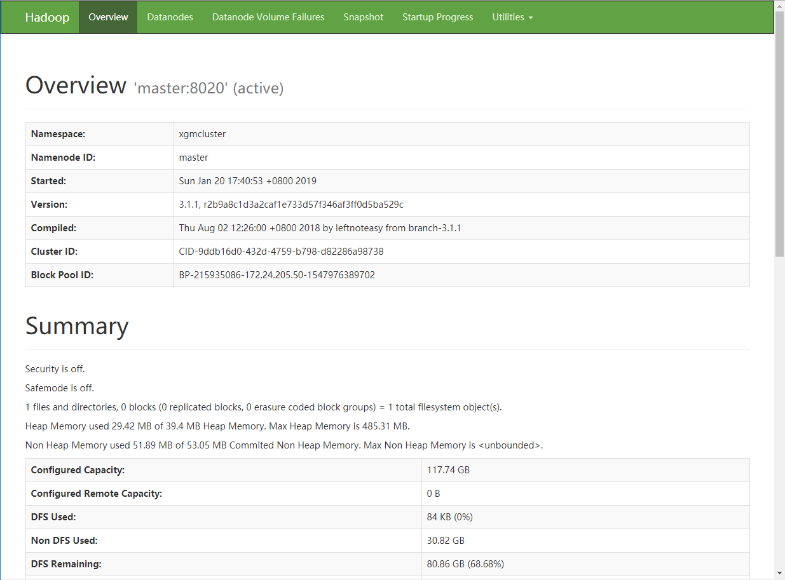

# Hadoop3分布式HA模式搭建

HA模式即高可用模式，这个模式之下namenode挂掉没事，备用节点可以顶上。但是该模式安装比较麻烦，需要安装zookeeper作为集群调度器判断namenode是否离线，还要配置journalnode进行日志转存操作等等。

这里参考的资料主要来源于杨曦所著的[HBASE不睡觉书](https://read.douban.com/ebook/51046818/)，这本书口语化的表达非常适合初学者阅读，是一本入门佳作。

还有部分资料参考[网络](https://www.cnblogs.com/wanshoushou/p/5606662.html)。

**特别注意**！环境变量设置请参考之前的文章：[Hadoop3分布式+Hadoop Streaming环境搭建](./Hadoop_distribute.md)，看本文前最好先保证能够运行hadoop非HA模式。

## 目录

- [zookeeper安装](#1)
- [hadoop HA 模式配置](#2)

## <p id=1>zookeeper安装

### 下载解压

首先下载解压。
```
cd ~/xiazai;
wget http://ftp.cuhk.edu.hk/pub/packages/apache.org/zookeeper/zookeeper-3.4.13/zookeeper-3.4.13.tar.gz;
tar -zxvf zookeeper-3.4.13.tar.gz;
mv zookeeper-3.4.13 /opt/;
```

### 设置集群配置文件

需要配置5处，分别是环境变量、zoo.cfg、myid、zkEnv.sh，建立目录并设置权限，直接copy即可。

```
echo '配置环境变量';
echo '
# ZOOKEEPER SETTINGS
export ZOOKEEPER_HOME=/opt/zookeeper-3.4.13' >> /etc/bash.bashrc;
source /etc/bash.bashrc;

echo '设置zoo.cfg';
echo 'tickTime=2000
initLimit=10
syncLimit=5
dataDir=/data/zookeeper
clientPort=2181
server.255=master:2888:3888
server.1=slave1:2888:3888
server.2=slave2:2888:3888
server.3=slave3:2888:3888' > /opt/zookeeper-3.4.13/conf/zoo.cfg;

echo '设置zkEnv.sh';
sed -i '26i ZOO_LOG_DIR=/data/logs/zookeeper' /opt/zookeeper-3.4.13/bin/zkEnv.sh;

echo '设置master的myid';
rm -rf /data;
mkdir -p /data/zookeeper;
touch /data/zookeeper/myid;
echo '255' > /data/zookeeper/myid;

echo '设置权限';
chown root.root /data/zookeeper;
mkdir -p /data/logs/zookeeper;
chown root.root /data/logs/zookeeper;
```
### 分发与启动

这里只要直接把刚刚配置好的文件夹整个复制到集群即可。

```
scp -r /opt/zookeeper-3.4.13 root@slave1:/opt;
scp -r /opt/zookeeper-3.4.13 root@slave2:/opt;
scp -r /opt/zookeeper-3.4.13 root@slave3:/opt;
ls
```

复制完文件之后需要分别进入每节点建立目录和myid文件，命令如下。

`ssh root@slave1`
```
echo '
# ZOOKEEPER SETTINGS
export ZOOKEEPER_HOME=/opt/zookeeper-3.4.13' >> /etc/bash.bashrc;
source /etc/bash.bashrc;

mkdir -p /data/zookeeper;
chown root.root /data/zookeeper;
touch /data/zookeeper/myid;
echo '1' > /data/zookeeper/myid;

mkdir -p /data/hadoop/hdfs/namenode;

rm -rf /data/logs/zookeepers/*;
rm -rf /data/zookeepers/*;
$ZOOKEEPER_HOME/bin/zkServer.sh start;

exit
```

`ssh root@slave2`
```
echo '
# ZOOKEEPER SETTINGS
export ZOOKEEPER_HOME=/opt/zookeeper-3.4.13' >> /etc/bash.bashrc;
source /etc/bash.bashrc;

mkdir -p /data/zookeeper;
chown root.root /data/zookeeper;
touch /data/zookeeper/myid;
echo '2' > /data/zookeeper/myid;

rm -rf /data/logs/zookeepers/*;
rm -rf /data/zookeepers/*;
$ZOOKEEPER_HOME/bin/zkServer.sh start;

exit
```

`ssh root@slave3`
```
echo '
# ZOOKEEPER SETTINGS
export ZOOKEEPER_HOME=/opt/zookeeper-3.4.13' >> /etc/bash.bashrc;
source /etc/bash.bashrc;

mkdir -p /data/zookeeper;
chown root.root /data/zookeeper;
touch /data/zookeeper/myid;
echo '3' > /data/zookeeper/myid;

rm -rf /data/logs/zookeepers/*;
rm -rf /data/zookeepers/*;
$ZOOKEEPER_HOME/bin/zkServer.sh start;

exit
```

### master启动

配置完毕之后直接启动即可。根据教材的说法，最好清理下log文件，避免启动失败。

```
rm -rf /data/logs/zookeepers/*;
rm -rf /data/zookeepers/*;
$ZOOKEEPER_HOME/bin/zkServer.sh start;
$ZOOKEEPER_HOME/bin/zkServer.sh status
```

如果能够显示如下，则zookeeper启动成功。bash的输出中能看到该节点的mode为leader。
```bash
root@master:~# $ZOOKEEPER_HOME/bin/zkServer.sh status
ZooKeeper JMX enabled by default
Using config: /opt/zookeeper-3.4.13/bin/../conf/zoo.cfg
Mode: leader
```

### 查看日志

启动失败是很正常的，通过如下命令能够查看日志
```
vim /data/logs/zookeeper/zookeeper.out
```

### 停止

先不用停止zkServer。

```
$ZOOKEEPER_HOME/bin/zkServer.sh stop
```

## <p id=2>hadoop HA 模式配置


### 拷贝配置文件

比较快的方法是直接clone本项目，进入本项目根目录执行以下命令，把`./Documentations/Hadoop3_config_files`整个文件夹拷到云端。
```
scp -r ./Documentations/Hadoop3_config_files root@master:/root/;
```

在master端，我们可以直接把`etc-HA`中的配置文件拷贝到相应的位置，完成安装。

```
cp -f /root/Hadoop3_config_files/etc-HA/* /opt/hadoop-3.1.2/etc/hadoop/;
scp /root/Hadoop3_config_files/etc-HA/* root@slave1:/opt/hadoop-3.1.2/etc/hadoop/;
scp /root/Hadoop3_config_files/etc-HA/* root@slave2:/opt/hadoop-3.1.2/etc/hadoop/;
scp /root/Hadoop3_config_files/etc-HA/* root@slave3:/opt/hadoop-3.1.2/etc/hadoop/;

cp -f /root/Hadoop3_config_files/sbin-HA/* /opt/hadoop-3.1.2/sbin/;
scp /root/Hadoop3_config_files/sbin-HA/* root@slave1:/opt/hadoop-3.1.2/sbin/;
scp /root/Hadoop3_config_files/sbin-HA/* root@slave2:/opt/hadoop-3.1.2/sbin/;
scp /root/Hadoop3_config_files/sbin-HA/* root@slave3:/opt/hadoop-3.1.2/sbin/;
```

### 配置文件说明

主要修改两个文件。源码请看本项目`Documentations/Hadoop3_config_files/etc-HA/`下的各种配置文件。

#### core-site.xml

HA模式需要大改core-site.xml。

需要将`fs.defaultFS`修改为clustername，即从zookeeper获取端口号，不用具体指定。

还需要在`ha.zookeeper.quorum`指定zookeeper的地址。

#### hdfs-site.xml

hdfs-site.xml同样需要大改。

需要设置master和slave1为namenode，并设置相应的端口号。

### 设置journalnode

在4台机器上使用如下命令，即4台机器都作为journalnode
```
mkdir -p /data/hadoop/hdfs/jn;
chown root:root /data/hadoop/hdfs/jn;
hdfs --daemon start journalnode;
exit
```

### 启动

首次启动请**严格按照顺序**！

1. 每台机器都启动zookeeper。

上文已经启动。
```
$ZOOKEEPER_HOME/bin/zkServer.sh start;
$ZOOKEEPER_HOME/bin/zkServer.sh status
```

2. 每台机器都启动journalnode
```
hdfs --daemon start journalnode
```

3. 格式化HDFS

在master上执行
```
hdfs namenode -format
```

4. 格式化备用namenode

在slave1执行
```
hdfs namenode -bootstrapStandby
```

5. 初始化namenode

在master上执行
```
hdfs namenode -initializeSharedEdits
```

6. 格式化ZKFC

在master上执行
```
hdfs zkfc -formatZK
```
7. 启动

在master上
```
start-dfs.sh;
start-yarn.sh
```

如果一切顺利，分别进入master和slave1，执行如下命令，可以看到输出为active和standby。
```bash
root@master:~# jps
11296 NameNode
8932 JournalNode
8679 QuorumPeerMain
13256 Jps
12426 DFSZKFailoverController
root@master:~# hdfs haadmin -getServiceState master
active
root@master:~# ssh root@slave1
Welcome to Ubuntu 18.04.1 LTS (GNU/Linux 4.15.0-43-generic x86_64)
...
...
...
root@slave1:~# hdfs haadmin -getServiceState slave1
standby
root@slave1:~# exit
```
打开网址`http://master:50070`，页面中能看到clustername


以后启动，只需要在master端直接执行
```
start-dfs.sh;
start-yarn.sh;
```

输出如下
```bash
root@master:~# start-dfs.sh
Starting namenodes on [master slave1]
Starting datanodes
Starting journal nodes [slave3 slave2 slave1 master]
Starting ZK Failover Controllers on NN hosts [master slave1]
root@master:~# start-yarn.sh
Starting resourcemanager
Starting nodemanagers
```


## 错误与调试

### No valid image files found

这里遇到如下错误，且执行namenode format之后依然存在。

```
2019-01-24 01:39:53,634 WARN org.apache.hadoop.hdfs.server.namenode.FSNamesystem: Encountered exception loading fsimage
java.io.FileNotFoundException: No valid image files found
        at org.apache.hadoop.hdfs.server.namenode.FSImageTransactionalStorageInspector.getLatestImages(FSImageTransactionalStorageInspector.java:158)
        at org.apache.hadoop.hdfs.server.namenode.FSImage.loadFSImage(FSImage.java:672)
        at org.apache.hadoop.hdfs.server.namenode.FSImage.recoverTransitionRead(FSImage.java:323)
        at org.apache.hadoop.hdfs.server.namenode.FSNamesystem.loadFSImage(FSNamesystem.java:1086)
        at org.apache.hadoop.hdfs.server.namenode.FSNamesystem.loadFromDisk(FSNamesystem.java:714)
        at org.apache.hadoop.hdfs.server.namenode.NameNode.loadNamesystem(NameNode.java:632)
        at org.apache.hadoop.hdfs.server.namenode.NameNode.initialize(NameNode.java:694)
        at org.apache.hadoop.hdfs.server.namenode.NameNode.<init>(NameNode.java:937)
        at org.apache.hadoop.hdfs.server.namenode.NameNode.<init>(NameNode.java:910)
        at org.apache.hadoop.hdfs.server.namenode.NameNode.createNameNode(NameNode.java:1643)
        at org.apache.hadoop.hdfs.server.namenode.NameNode.main(NameNode.java:1710)
```

最后通过查询journalnode的日志，终于发现端倪。是因为`/data/hadoop/hdfs/jn/`非空造成，这个路径在`hdfs-site.xml`文件中设置，表示JournalNode在本地磁盘存放数据的位置。因为笔者调试时多次执行namenode format但没有清空该目录，导致journalnode启动失败，但是jps中依然能够显示，最后导致namenode无法启动。

找到错误就很简单，只要`rm -rf /data/hadoop/hdfs/jn/*`再重新对namenode format即可。
