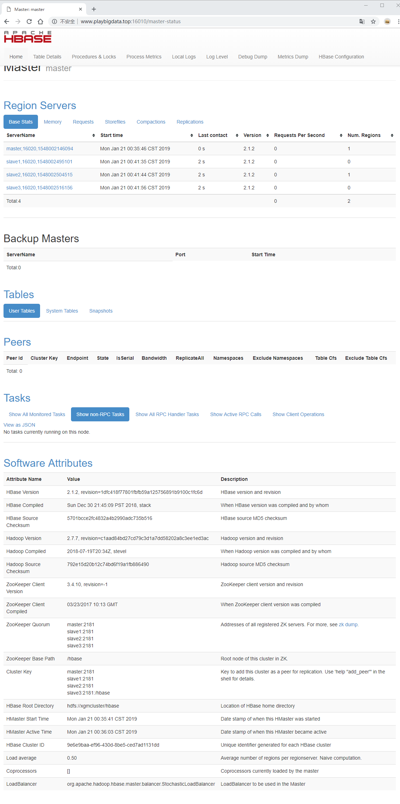

# HBASE分布式环境搭建

这里参考的资料主要来源于杨曦所著的[HBASE不睡觉书](https://read.douban.com/ebook/51046818/)，这本书口语化的表达非常适合初学者阅读，是一本入门佳作。

## 目录

- [下载](#1)
- [配置](#2)
- [启动](#3)
- [错误与调试](#4)

## <p id=1>下载

下载解压
```
cd xiazai;
wget http://mirror.bit.edu.cn/apache/hbase/2.1.2/hbase-2.1.2-bin.tar.gz;
tar -xzf hbase-2.1.2-bin.tar.gz -C /opt/;
```

## <p id=2>配置

hbase的HA模式和伪分布模式、单机模式配置不一样，这里直接搭建分布式。例如只需要提供cluster名称而不用提供端口号，因为使用zookeeper调用。**特别注意**的是，这里的环境一定要基于zookeeper集群启动才能搭建成功。

这里需要配置环境变量、./conf/hase-env.sh、./conf/hbase-site.xml，然后分发到每个节点。直接copy就好。
```
echo '配置环境变量';
echo '
# HBASE SETTINGS
export HBASE_HOME=/opt/hbase-2.1.2
' >> /etc/bash.bashrc;
source /etc/bash.bashrc;
mkdir -p /data/logs/hbase;
mkdir -p /data/hbase/tmp/zk/data;

echo '配置./conf/hase-env.sh';
echo 'export HBASE_OPTS="$HBASE_OPTS -XX:+UseConcMarkSweepGC"
export JAVA_HOME=$JAVA_HOME
export HBASE_MANAGES_ZK=false
export HBASE_CLASSPATH=$HADOOP_HOME/etc/hadoop
export HBASE_LOG_DIR=/data/logs/hbase' > /opt/hbase-2.1.2/conf/hbase-env.sh;

echo '配置./conf/hbase-site.xml';
echo '<?xml version="1.0"?>
<?xml-stylesheet type="text/xsl" href="configuration.xsl"?>
<configuration>

    <property> 
        <name>hbase.rootdir</name> 
        <value>hdfs://xgmcluster/hbase</value> 
    </property>

    <property> 
        <name>hbase.cluster.distributed</name> 
        <value>true</value> 
    </property> 

    <property> 
        <name>hbase.zookeeper.quorum</name> 
        <value>master,slave1,slave2,slave3</value> 
    </property>

    <property> 
        <name>hbase.zookeeper.property.dataDir</name> 
        <value>/data/hbase/tmp/zk/data</value> 
    </property>

    <property>
        <name>hbase.unsafe.stream.capability.enforce</name>
        <value>false</value>
    </property>

    <property> 
        <name>hbase.wal.provider</name> 
        <value>filesystem</value> 
    </property> 

</configuration>' > /opt/hbase-2.1.2/conf/hbase-site.xml;

echo '详见错误调试';
rm /opt/hbase-2.1.2/lib/client-facing-thirdparty/slf4j-log4j12-1.7.25.jar;
cp $HBASE_HOME/lib/client-facing-thirdparty/htrace-core-3.1.0-incubating.jar $HBASE_HOME/lib/

echo '分发';
scp -r /opt/hbase-2.1.2 root@slave1:/opt/;
scp -r /opt/hbase-2.1.2 root@slave2:/opt/;
scp -r /opt/hbase-2.1.2 root@slave3:/opt/;
ls;
```

使用ssh进入每一个slave，执行以下命令
```
echo '配置环境变量';
echo '
# HBASE SETTINGS
export HBASE_HOME=/opt/hbase-2.1.2
' >> /etc/bash.bashrc;
source /etc/bash.bashrc;
mkdir -p /data/logs/hbase;
mkdir -p /data/hbase/tmp/zk/data;

echo '启动regionserver';
$HBASE_HOME/bin/hbase-daemon.sh start regionserver
exit
```

## <p id=3>启动

上面已经在各个slave启动好了regionserver，这里只要返回master，执行如下命令即可
```
$HBASE_HOME/bin/hbase-daemon.sh start master
```

值得注意的是，还能用如下方式启动，但奇怪是在master上执行如下命令，不能连带启动slave的regionserver。目前没有解决，只能通过上面的命令分别进入节点启动服务。
```
$HBASE_HOME/bin/start-hbase.sh
```

有意思的是批量stop是可以的...
```
$HBASE_HOME/bin/stop-hbase.sh
```
启动成功后，使用`jps`能看到
```bash
root@master:~# jps
11296 NameNode
21122 HRegionServer
8932 JournalNode
20981 HMaster
8679 QuorumPeerMain
12426 DFSZKFailoverController
21660 Jps
```

打开网址`http://master:16010`可以看到WebUI，如下图



## <p id=4>错误与调试

### Class path contains multiple SLF4J bindings.

使用`vim /opt/hbase-2.1.2/logs/hbase-root-master-master.out`查看日志，得到
```
SLF4J: Class path contains multiple SLF4J bindings.
SLF4J: Found binding in [jar:file:/opt/hadoop-3.1.1/share/hadoop/common/lib/slf4j-log4j12-1.7.25.jar!/org/slf4j/impl/StaticLoggerBinder.class]
SLF4J: Found binding in [jar:file:/opt/hbase-2.1.2/lib/client-facing-thirdparty/slf4j-log4j12-1.7.25.jar!/org/slf4j/impl/StaticLoggerBinder.class]
SLF4J: See http://www.slf4j.org/codes.html#multiple_bindings for an explanation.
SLF4J: Actual binding is of type [org.slf4j.impl.Log4jLoggerFactory]

```
如提示，删掉一个jar即可，上文已经增加。
```
rm /opt/hbase-2.1.2/lib/client-facing-thirdparty/slf4j-log4j12-1.7.25.jar
```

### Caused by: java.lang.ClassNotFoundException: org.apache.htrace.SamplerBuilder

迷之错误，网上搜到的办法，能用。
```
cp $HBASE_HOME/lib/client-facing-thirdparty/htrace-core-3.1.0-incubating.jar $HBASE_HOME/lib/
```

### java.lang.IllegalStateException

错误如下
```
java.lang.IllegalStateException: The procedure WAL relies on the ability to hsync for proper operation during component failures, but the underlying filesystem does not support doing so. Please check the config value of 'hbase.procedure.store.wal.use.hsync' to set the desired level of robustness and ensure the config value of 'hbase.wal.dir' points to a FileSystem mount that can provide it.
```

在hbase-site.xml中新增如下内容。上文已经增加。

```xml
<property>
<name>hbase.unsafe.stream.capability.enforce</name>
<value>false</value>
</property>
```