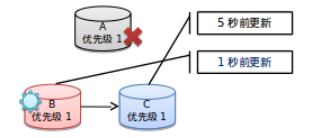

# MongoDB的全分布式安装

如[[Hadoop3全分布式+Hadoop streaming环境搭建](./Hadoop_distribute.md)所述，阅读本小章的前提条件是已经申请5个云服务器结点，修改好相应的host文件，并开启了所有的端口访问权限。  

这里简要分为三小节。  

> [云端单机版配置](#1)  
> [真实分布式配置](#2)  
> [测试](#3)


## <a id="1">云端单机版配置</a>

***下载tgz文件并上传到阿里云，解压到相应目录*** 

**注意版本匹配**。本地是ubuntu18，master是ubuntu16。
`scp mongodb-linux-x86_64-ubuntu1604-4.0.4.tgz root@hadoop_xgm:/`
`ssh root@hadoop_xgm`

***复制到每一个结点***  
```
scp mongodb-linux-x86_64-ubuntu1604-4.0.4.tgz root@slave1: ;
scp mongodb-linux-x86_64-ubuntu1604-4.0.4.tgz root@slave2: ;   
scp mongodb-linux-x86_64-ubuntu1604-4.0.4.tgz root@slave3: ;   
scp mongodb-linux-x86_64-ubuntu1604-4.0.4.tgz root@slave4: ;   
```

***依次进入5个机器***  
```
ssh root@slave1  
ssh root@slave2  
ssh root@slave3  
ssh root@slave4   
```

我们可以使用分号连接命令，依次执行，这样快一些。**注意**这里使用>>写入环境变量，每执行一次bash文件末尾就增加一行。
```
tar -zxvf /root/mongodb-linux-x86_64-ubuntu1604-4.0.4.tgz -C /root/;
mv /root/mongodb-linux-x86_64-ubuntu1604-4.0.4 /opt/mongodb;
echo 'export MONGODB_HOME=/opt/mongodb' >> /etc/bash.bashrc;
echo 'export PATH=$MONGODB_HOME/bin:$PATH' >> /etc/bash.bashrc;
source /etc/bash.bashrc;
```

在每一台机器上***输入***`mongod`，测试配置路径是否正确。得到以下输出说明配置正确。  
```
root@master:/# mongod
mongod: error while loading shared libraries: libcurl.so.4: cannot open shared object file: No such file or directory
```

接着在master上运行如下命令，启动单节点mongo。 
```
sudo mkdir -p /opt/mongodb_data/data;
sudo mkdir -p /opt/mongodb_data/logs;

mongod --dbpath /opt/mongodb_data/data --logpath /opt/mongodb_data/logs/mongod.log --fork
```
我这里启动遇到了问题  
```
root@master:/usr/lib/x86_64-linux-gnu# mongod --dbpath /opt/mongodb_data/data --logpath /opt/mongodb_data/logs/mongod.log
mongod: error while loading shared libraries: libcurl.so.4: cannot open shared object file: No such file or directory
```
经过[查询](https://blog.csdn.net/a41888313/article/details/79979622)，安装依赖即可解决：  
`apt-get install libcurl4-openssl-dev`    
   


## <a id="2">真实分布式配置</a>

接下来我们设置真实分布式配置。  

关于mongodb分布式系统概念知识，可以参考[这里](https://blog.toright.com/posts/4552/mongodb-sharding-%E5%88%86%E6%95%A3%E5%BC%8F%E5%84%B2%E5%AD%98%E6%9E%B6%E6%A7%8B%E5%BB%BA%E7%BD%AE-%E6%A6%82%E5%BF%B5%E7%AF%87.html)。  

这里笔者简单浓缩一下相关概念：  

> mongodb使用config服务器存储分布式文件的索引等内容  
> mongodb使用mongs作为路由工具  
> mongodb使用shard进行数据库分片  
> mongod命令是在本地启动各种服务，mongos是在已经打开端口的结点之间建立路由，mongo是分布式shell的总入口  

接下来先按照本文进行配置，之后就能大概明白mongodb的启动逻辑。  

笔者的配置思路：3台config，4个shard。config port:27100,shard[1-4] port:[27001-27004],mongs port:27000

***在3个节点上建立mongos日志存储目录***（master;slave[1~2]）  
```
sudo mkdir -p /data/data1/mongodb/mongos/log  
sudo chown -R root:root /data  
sudo mkdir -p /data/data1/mongodb/configServer/db  
sudo chown -R root:root /data  
sudo mkdir -p /data/data1/mongodb/configServer/log  
sudo chown -R root:root /data  
```


***在4个节点上建立数据文件和日志文件存放目录***（slave[1~4]）
```
mkdir -p /data/data1/mongodb/shard1/db;
mkdir -p /data/data1/mongodb/shard1/log;
mkdir -p /data/data1/mongodb/shard2/db;
mkdir -p /data/data1/mongodb/shard2/log;
mkdir -p /data/data1/mongodb/shard3/db;
mkdir -p /data/data1/mongodb/shard3/log;
mkdir -p /data/data1/mongodb/shard4/db;
mkdir -p /data/data1/mongodb/shard4/log;
```

***在3台config服务器启动configsvr***（master;slave[1~2]）  

分别执行以下命令。这里要注意，`--bind_ip=master --port 27100`参数需要替换成相应的参数，特别是bind_ip，应该根据自己的hosts文件设置进行填写。  
```
mongod --configsvr --replSet cfgRepset --bind_ip=master --port 27100 --directoryperdb --dbpath /data/data1/mongodb/configServer/db --logpath /data/data1/mongodb/configServer/log/mongodb.log --fork
```
```
ssh root@slave1;
mongod --configsvr --replSet cfgRepset --bind_ip=slave1 --port 27100 --directoryperdb --dbpath /data/data1/mongodb/configServer/db --logpath /data/data1/mongodb/configServer/log/mongodb.log --fork
```
```
ssh root@slave2;
mongod --configsvr --replSet cfgRepset --bind_ip=slave2 --port 27100 --directoryperdb --dbpath /data/data1/mongodb/configServer/db --logpath /data/data1/mongodb/configServer/log/mongodb.log --fork
```

在三台机器上运行成功上述代码之后，我们可以通过`ps -ef | grep mongod`命令查看相应进程是否存在，以及进程占用的端口。  

正确的结果如下：  
```
root@slave1:~# ps -ef | grep mongod
root      7437     1  0 Dec11 ?        00:05:40 mongod --configsvr --replSet cfgRepset --bind_ip=slave1 --port 27100  --directoryperdb --dbpath /data/data1/mongodb/configServer/db --logpath /data/data1/mongodb/configServer/log/mongodb.log --fork
```

还可以使用`netstat -a | grep 27100`命令查看27100端口的使用情况，结果如下：
```
root@slave1:~# netstat -a | grep 27100
tcp        0      0 slave1:27100      *:*                     LISTEN     
unix  2      [ ACC ]     STREAM     LISTENING     159703   /tmp/mongodb-27100.sock
```
确认完毕后，回到master结点，进行下一步操作，将3台打开了27100端口的config服务器进行连接、配置。  

***在master主机进入sell***    
`mongo --host master --port 27100`  

***为config服务器配置3个副本***，命令如下，非常好懂：  
```
rs.initiate({ _id:"cfgRepset", configsvr:true,members:[
{_id:0,host:"master:27100"},
{_id:1,host:"slave1:27100"},
{_id:2,host:"slave2:27100"}]
});
```
注意观察是否有报错，如果一切顺利，最后一行将会变成：`cfgRepset:PRIMARY>`，说明你现在已经处在`PRIMARY`主结点。仔细观察shell的输出，可以看到slave1和slave2的结点状态都是`SECONDARY`。根据mongodb的调度规则，当主节点宕机，次要结点将会变成主节点，且相应的值也会变成`PRIMARY`。  

当然，我们也可以通过`rs.status()`查询状态。这时登陆任意slave结点，使用`netstat -a | grep 27100`查看状态，可以发现slave已经和master连接，有兴趣的读者可以试一试。  

使用`exit`退出，进行下一步配置。  


分片服务器（shard）  
***结点1启动4个shard***  
```
ssh root@slave1
mongod --shardsvr --replSet shard1 --bind_ip=slave1 --port 27001 --dbpath /data/data1/mongodb/shard1/db --logpath /data/data1/mongodb/shard1/log/shard1.log --directoryperdb  --fork;

mongod --shardsvr --replSet shard2 --bind_ip=slave1 --port 27002 --dbpath /data/data1/mongodb/shard2/db --logpath /data/data1/mongodb/shard2/log/shard2.log --directoryperdb  --fork;

mongod --shardsvr --replSet shard3 --bind_ip=slave1 --port 27003 --dbpath /data/data1/mongodb/shard3/db --logpath /data/data1/mongodb/shard3/log/shard3.log --directoryperdb  --fork;

mongod --shardsvr --replSet shard4 --bind_ip=slave1 --port 27004 --dbpath /data/data1/mongodb/shard4/db --logpath /data/data1/mongodb/shard4/log/shard4.log --directoryperdb  --fork;
```

***结点2启动4个shard***  
```
ssh root@slave2
mongod --shardsvr --replSet shard1 --bind_ip=slave2 --port 27001 --dbpath /data/data1/mongodb/shard1/db --logpath /data/data1/mongodb/shard1/log/shard1.log --directoryperdb  --fork;

mongod --shardsvr --replSet shard2 --bind_ip=slave2 --port 27002 --dbpath /data/data1/mongodb/shard2/db --logpath /data/data1/mongodb/shard2/log/shard2.log --directoryperdb  --fork;

mongod --shardsvr --replSet shard3 --bind_ip=slave2 --port 27003 --dbpath /data/data1/mongodb/shard3/db --logpath /data/data1/mongodb/shard3/log/shard3.log --directoryperdb  --fork;

mongod --shardsvr --replSet shard4 --bind_ip=slave2 --port 27004 --dbpath /data/data1/mongodb/shard4/db --logpath /data/data1/mongodb/shard4/log/shard4.log --directoryperdb  --fork;
```

***结点3启动4个shard***    
```
ssh root@slave3
mongod --shardsvr --replSet shard1 --bind_ip=slave3 --port 27001 --dbpath /data/data1/mongodb/shard1/db --logpath /data/data1/mongodb/shard1/log/shard1.log --directoryperdb  --fork;

mongod --shardsvr --replSet shard2 --bind_ip=slave3 --port 27002 --dbpath /data/data1/mongodb/shard2/db --logpath /data/data1/mongodb/shard2/log/shard2.log --directoryperdb  --fork;

mongod --shardsvr --replSet shard3 --bind_ip=slave3 --port 27003 --dbpath /data/data1/mongodb/shard3/db --logpath /data/data1/mongodb/shard3/log/shard3.log --directoryperdb  --fork;

mongod --shardsvr --replSet shard4 --bind_ip=slave3 --port 27004 --dbpath /data/data1/mongodb/shard4/db --logpath /data/data1/mongodb/shard4/log/shard4.log --directoryperdb  --fork;
```
***结点4启动4个shard***  
```
ssh root@slave4
mongod --shardsvr --replSet shard1 --bind_ip=slave4 --port 27001 --dbpath /data/data1/mongodb/shard1/db --logpath /data/data1/mongodb/shard1/log/shard1.log --directoryperdb  --fork;

mongod --shardsvr --replSet shard2 --bind_ip=slave4 --port 27002 --dbpath /data/data1/mongodb/shard2/db --logpath /data/data1/mongodb/shard2/log/shard2.log --directoryperdb  --fork;

mongod --shardsvr --replSet shard3 --bind_ip=slave4 --port 27003 --dbpath /data/data1/mongodb/shard3/db --logpath /data/data1/mongodb/shard3/log/shard3.log --directoryperdb  --fork;

mongod --shardsvr --replSet shard4 --bind_ip=slave4 --port 27004 --dbpath /data/data1/mongodb/shard4/db --logpath /data/data1/mongodb/shard4/log/shard4.log --directoryperdb  --fork;
```


到这里，我们已经在各个机器上打开了所有的端口，接下来将4个机器（slave1~4）连起来。因为我的配置是4台机器，4个shards，每台机器都有存储一个shard，因此我只需要ssh进入其中的任何一台，初始化4个shard的配置即可。这里进入slave1，并配置。  


***在slave1的27001端口启动mongo***，并初始化。
```
mongo --host slave1 --port 27001
use admin;
rs.initiate(
{ _id:"shard1", members:[
{_id:0,host:"slave1:27001"},
{_id:1,host:"slave2:27001"},
{_id:2,host:"slave3:27001"},
{_id:3,host:"slave4:27001",arbiterOnly:true}
]
}
);
```

***同样在slave1，从27002端口启动mongo***，并初始化。
```
mongo --host slave1 --port 27002
use admin;
rs.initiate(
{ _id:"shard2", members:[
{_id:0,host:"slave1:27002"},
{_id:1,host:"slave2:27002"},
{_id:2,host:"slave3:27002"},
{_id:3,host:"slave4:27002",arbiterOnly:true}
]
}
);
```

***同样在slave1，从27003端口启动mongo***，并初始化。
```
mongo --host slave1 --port 27003
use admin;
rs.initiate(
{ _id:"shard3", members:[
{_id:0,host:"slave1:27003"},
{_id:1,host:"slave2:27003"},
{_id:2,host:"slave3:27003"},
{_id:3,host:"slave4:27003",arbiterOnly:true}
]
}
);
```

***同样在slave1，从27004端口启动mongo***，并初始化。  
```
mongo --host slave1 --port 27004
use admin;
rs.initiate(
{ _id:"shard4", members:[
{_id:0,host:"slave1:27004"},
{_id:1,host:"slave2:27004"},
{_id:2,host:"slave3:27004"},
{_id:3,host:"slave4:27004",arbiterOnly:true}
]
}
);
```


初始化成功之后的输出应该如下：  
```
> use admin;
switched to db admin
> rs.initiate(
... { _id:"shard4", members:[
... {_id:0,host:"slave1:27004"},
... {_id:1,host:"slave2:27004"},
... {_id:2,host:"slave3:27004"},
... {_id:3,host:"slave4:27004",arbiterOnly:true}
... ]
... }
... );
{
	"ok" : 1,
	"operationTime" : Timestamp(1544612438, 1),
	"$clusterTime" : {
		"clusterTime" : Timestamp(1544612438, 1),
		"signature" : {
			"hash" : BinData(0,"AAAAAAAAAAAAAAAAAAAAAAAAAAA="),
			"keyId" : NumberLong(0)
		}
	}
}
shard4:SECONDARY> 
```


终于进入最后一步，***在3台config服务器分别启动mongos**（master&slave1&slave2）  
`mongos --configdb cfgRepset/master:27100,slave1:27100,slave2:27100 --bind_ip master --port 27000  --logpath  /data/data1/mongodb/mongos/log/mongos.log --fork`  


***使用ssh进入slave1和slave2，再次执行上述命令***，即可。
```
ssh root@slave1
mongos --configdb cfgRepset/master:27100,slave1:27100,slave2:27100 --bind_ip slave1 --port 27000  --logpath  /data/data1/mongodb/mongos/log/mongos.log --fork

```
```
ssh root@slave2
mongos --configdb cfgRepset/master:27100,slave1:27100,slave2:27100 --bind_ip slave2 --port 27000  --logpath  /data/data1/mongodb/mongos/log/mongos.log --fork

```


成功的话，输出如下：  
```
root@slave2:~# mongos --configdb cfgRepset/master:27100,slave1:27100,slave2:27100 --bind_ip slave2 --port 27000  --logpath  /data/data1/mongodb/mongos/log/mongos.log --fork
2018-12-12T19:14:07.193+0800 I CONTROL  [main] Automatically disabling TLS 1.0, to force-enable TLS 1.0 specify --sslDisabledProtocols 'none'
about to fork child process, waiting until server is ready for connections.
forked process: 31196
child process started successfully, parent exiting
```


恭喜你，至此，mongodb的数据（分片+副本），配置服务器（config server），路由服务器（mongos）都已经配置好了。  
具体为：  
master | slave1 | slave2 | slave3 | slave4
--- | --- | --- | --- | ---
mongos:27000|mongos:27000|mongos:27000|None | None
None | shard1:27001 | shard1:27001 | shard1:27001 | shard1:27001
None | shard2:27002 | shard2:27002 | shard2:27002 | shard2:27002
None | shard3:27003 | shard3:27003 | shard3:27003 | shard3:27003
None | shard4:27004 | shard4:27004 | shard4:27004 | shard4:27004

到这里，我们可以回顾安装流程，可以看到，其实mongodb的安装逻辑很简单，但是过程比较繁琐。。  

首先，我们配置config服务器，自己选定2个或者3个结点，在结点端使用mongod命令，加上--configsvr表示配置config，然后在自己定的27100端口开启服务。之后我们任意进入一台机器，使用shell添加所有config服务器的ip和端口信息，mongodb会自动连接相应结点并且初始化完毕。shard的配置流程完全一样，分别在我们自定的机器上，使用mongod --shardsvr，在不同的端口开启服务，然后相互连接。唯一有一点点区别的是mongos，它需要连接已经开启的27100端口，并且在27000上启动自己。下面，我们就可以直接使用mongo命令，连接27000端口，即直接连接路由端口进行操作。  

我们现在需要登录路由节点，激活数据库分片（shards），指定将什么数据库进行分布式存储。  

***回到master，进入mongo***  

执行`mongo --host master --port 27000`，此时，shell显示为`mongos>`  

***输入如下：***  
```
sh.addShard("shard1/slave1:27001");
sh.addShard("shard2/slave2:27002");
sh.addShard("shard3/slave3:27003");
sh.addShard("shard4/slave4:27004");
```
执行成功后，我们能在shell中看到`"ok" : 1`。  
执行`sh.status()`，我们可以查看shard的状态。其中，我们能看到：  
```json
  shards:
        {  "_id" : "shard1",  "host" : "shard1/slave1:27001,slave2:27001,slave3:27001",  "state" : 1 }
        {  "_id" : "shard2",  "host" : "shard2/slave1:27002,slave2:27002,slave3:27002",  "state" : 1 }
        {  "_id" : "shard3",  "host" : "shard3/slave1:27003,slave2:27003,slave3:27003",  "state" : 1 }
        {  "_id" : "shard4",  "host" : "shard4/slave1:27004,slave2:27004,slave3:27004",  "state" : 1 }
```
值得注意的是，这里居然只有slave1~3，那么slave4到哪去了？仔细观察之前的配置，我们能发现：`host:"slave4:27004",arbiterOnly:true`，那么，该结点是”仲裁结点“。根据官网以及网络的资料（[这里](https://docs.mongodb.com/manual/reference/replica-configuration/index.html)和[这里](https://blog.csdn.net/canot/article/details/50739359)）该结点不存数据，仅为仲裁使用。  



## <a id="3">测试</a>

终于到了最后一步：测试。
基本的操作有：  
> ==> 数据操作：  
> 插入数据：db.collection.insert  
> 查询数据：db.collection.find()  
> 更新数据：db.collection.update()  
> 删除数据：db.collection.remove()  
>   
> ==> collection操作：  
> 新建collection：  
> sh.shardCollection("xxx.yyy",{col1: 1, col2: 1})    
> 删除collection：  
> db.yyy.drop()  
>   
> ==> db操作：  
> 新建db  
> sh.enableSharding("xxx")  
> 删除db：  
> use xxx  
> db.dropDatabase();  

进入mong，`mongo --host master --port 27000`，***新建一个测试用数据库***：  
`sh.enableSharding("jim_data_test")`  

***建立collection和相关字段：***  
`sh.shardCollection("jim_data_test.jim_collections_test",{name:"hashed" , age: 1})`

我们注意到这个命令不寻常。经查询（[官网](https://docs.mongodb.com/manual/reference/method/sh.shardCollection/index.html)），sh.shardCollection() 会在建立Collection过程中自动创建索引。用法为：  
> sh.shardCollection(namespace, key, unique, options)  

关于key的取值，我们可以看到如下解释：  

> The index specification document to use as the shard key. The shard key determines how MongoDB distributes  the documents among the shards.  
>   
> The key of the index specification document is the field to use as the shard key. The value of the document  must be one of the following:  
>   
> - 1 to indicate forward traversal for the field.  
> - -1 to indicate reverse traversal for the field.  
> - "hashed" to specify a hashed shard key.  

这里说的是使用什么方式，以及对什么字段（Mongodb中称为Field）建立索引。考虑到负载均衡，这里尝试使用"hashed"方式对name字段建立索引。[点击这里](https://docs.mongodb.com/manual/core/hashed-sharding/)查看什么是Hashed Sharding。  

很神奇的是，上面的命令居然失败了，似乎shell不认"hashed"这个value...怀疑是bug。那么我***使用另一个等价命令***试试：    

`db.runCommand({"shardcollection":"jim_data_test.jim_collections_test","key":{"name":"hashed"}})`  

这次成功。  

***进入刚刚建立数据库***，即`jim_data_test`：  

`use jim_data_test`  

使用`for (i=1;i<=10000;i++) db.jim_collections_test.insert({name: "Jim No."+i, age: (i%233)})`***插入1W条数据***。等待不到10秒后shell输出`WriteResult({ "nInserted" : 1 })`，表示成功。  

使用`sh.status()`查询数据库状态，我们能看到name部分已经建立好了哈希索引：  
```json
...
{ "name" : { "$minKey" : 1 } } -->> { "name" : NumberLong("-6917529027641081850") } on : shard1 Timestamp(1, 0) 
{ "name" : NumberLong("-6917529027641081850") } -->> { "name" : NumberLong("-4611686018427387900") } on : shard1 Timestamp(1, 1) 
{ "name" : NumberLong("-4611686018427387900") } -->> { "name" : NumberLong("-2305843009213693950") } on : shard2 Timestamp(1, 2) 
...
```

最后一个命令，我们使用`db.jim_collections_test.find({age: {$gt: 230}})`，***查询age大于230的记录***，看到如下输出：  
```json
mongos> db.jim_collections_test.find({age: {$gt: 230}})
{ "_id" : ObjectId("5c110bc4ec3f3d9023d801ff"), "name" : "Jim No.232", "age" : 232 }
{ "_id" : ObjectId("5c110bc5ec3f3d9023d802e8"), "name" : "Jim No.465", "age" : 232 }
{ "_id" : ObjectId("5c110bc6ec3f3d9023d803d1"), "name" : "Jim No.698", "age" : 232 }
{ "_id" : ObjectId("5c110bc6ec3f3d9023d804ba"), "name" : "Jim No.931", "age" : 232 }
{ "_id" : ObjectId("5c110bc7ec3f3d9023d805a3"), "name" : "Jim No.1164", "age" : 232 }
{ "_id" : ObjectId("5c110bc7ec3f3d9023d8068c"), "name" : "Jim No.1397", "age" : 232 }
{ "_id" : ObjectId("5c110bc8ec3f3d9023d80775"), "name" : "Jim No.1630", "age" : 232 }
{ "_id" : ObjectId("5c110bc8ec3f3d9023d8085e"), "name" : "Jim No.1863", "age" : 232 }
{ "_id" : ObjectId("5c110bc9ec3f3d9023d80947"), "name" : "Jim No.2096", "age" : 232 }
{ "_id" : ObjectId("5c110bc9ec3f3d9023d80a30"), "name" : "Jim No.2329", "age" : 232 }
{ "_id" : ObjectId("5c110bcaec3f3d9023d80b19"), "name" : "Jim No.2562", "age" : 232 }
{ "_id" : ObjectId("5c110bcbec3f3d9023d80c02"), "name" : "Jim No.2795", "age" : 232 }
{ "_id" : ObjectId("5c110bcbec3f3d9023d80ceb"), "name" : "Jim No.3028", "age" : 232 }
{ "_id" : ObjectId("5c110bccec3f3d9023d80dd4"), "name" : "Jim No.3261", "age" : 232 }
{ "_id" : ObjectId("5c110bccec3f3d9023d80ebd"), "name" : "Jim No.3494", "age" : 232 }
{ "_id" : ObjectId("5c110bcdec3f3d9023d80fa6"), "name" : "Jim No.3727", "age" : 232 }
{ "_id" : ObjectId("5c110bcdec3f3d9023d8108f"), "name" : "Jim No.3960", "age" : 232 }
{ "_id" : ObjectId("5c110bceec3f3d9023d81178"), "name" : "Jim No.4193", "age" : 232 }
{ "_id" : ObjectId("5c110bcfec3f3d9023d81261"), "name" : "Jim No.4426", "age" : 232 }
{ "_id" : ObjectId("5c110bcfec3f3d9023d8134a"), "name" : "Jim No.4659", "age" : 232 }
Type "it" for more

```

至此全分布式的mongodb搭建成功。


