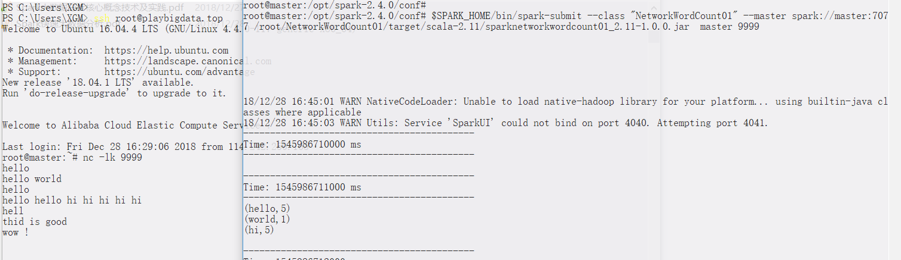
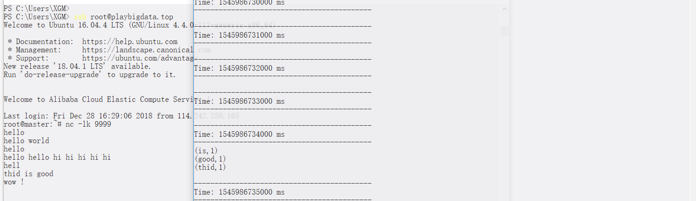

# Spark Streaming基础 (Scala)

[Spark Streaming官网](http://spark.apache.org/docs/latest/streaming-programming-guide.html)在这里。本文最后的`Spark Streaming例子`部分值得一看，提供了代码和运行截图。

其余的大部分内容均摘自机械工业出版社的《Spark大数据分析核心概念技术及实践》，提倡读者购买正版。本章只作为一个索引，供复习使用。


## 目录

> - [简介](#1)
> - [StreamingContext](#2)
> - [Spark Streaming 应用基本结构](#3)
> - [DStream](#4)
> - [处理数据流](#5)
> - [输出操作](#6)
> - [窗口操作](#7)
> - [Spark Streaming例子](#8)


## <p id=1>简介

这是一个分布式数据流处理框架，能够几乎实时地处理大量的数据流。

### API 

SparkStreaming API 有两个关键抽象 StreamingContext 和离散流 。 Spark Streaming 应用
可以使用这两个抽象来处理数据流 。

## <p id=2>StreamingContext

StreamingContext 是一个在 Spark Streaming 库中定义的类，它是 Spark Streaming 库
的入口点。每一个 Spark Streaming 应用都必须创建一个 StreamingContext 类实例 。

### 创建 StreamingContext 实例

创建 StreamingContext 类实例类似于创建 SparkContext 类实例 。 可以使用和l 创建
SparkContext 类实例同样的参数来创建 StreamingContext 类实例 。 然而，它还有额外的参
数用于指定将数据流分割成批的时间间隔 。

```
import org.apache.spark.
import org.apache.spark.streaming._
val config = new SparkConf().setMaster("spark://host:port").setAppName("big streaming app")
val batchInterval = 10
val ssc = new StreamingContext(conf, Seconds(batchInterval))
```
如果已经有了 SparkContext 类实例，可以用它来创建 StreamingContext 类实例 。
```
import org.apache.spark._
import org.apache.spark.streaming._
val config = new SparkConf().setMaster("spark://host:port").setAppName("big streaming app")
val sc = new SparkContext(conf)
val batch!nterval = 10
val ssc = new StreamingContext(sc, Seconds(batch!nterval))
```
上面的例子中每一批的时间间隔为 10 秒钟 。 Spark Streaming 将每 10 秒钟从数据流源创建一个 RDD

### 开始流式计算

Spark Streaming 应用只有在调用了 start 方法之后，才会开始接收数据 。

```
ssc.start()
```

### 检查点

```
ssc.checkpoint("hdfs://master:9000/...")
```

### 停止流式计算

这个方法有一个可选参数，标识是否只关闭 StreamingContext 对象. 在 StreamingContext对象关闭的情况下， SparkContext 可以用来创建另外一个 StreamingContext 类实例

```
ssc.stop(true)
```

### 等待流式计算结束

如果应用是多线程的，井且调用 start 方法的是其他线程．而不是主线程．此时必须使用 awaitTermination 方法 。 StreamingContext 中的 start 方法是一个阻 塞 方法，直到流式计算结束或停止，这个方法才返回 。 如果应用是单线程的，主线程会一直等待 start 方法返回 。然而，如果是其他线程调用了 start 方法，那么在主线程中你就必须调用awaitTermination方法以避免主线程过早退出.

```
ssc.awaitTermination()
```

## <p id=3>Spark Streaming 应用基本结构

```
import org.apache.spark._
import org.apache.spark.streaming._

object StreamProcessingApp {
    def main(args : Array[String]):Unit = {
        val interval = args(0).toInt
        val conf = new SparkConf()
        val ssc = new StreamingContext(conf,Seconds(interval))

        // add your code here

        ssc.start()
        ssc.awaitTermination()
    }
}
```

## <p id=4>DStream

DStream 是 Spark Streaming 库中定义的一个抽象类 。DStreamis 是一个无穷无尽的 RDD 序列.

### 基本源

socketTextStream

textFileStream

actorStream

### 高级源

Spark Streaming 本身不提供诸如Kafka 、 Flume 或 Twitter 这样的高级源创建 DStream
的工厂方法 ，只有第三方库才提供 。

```
import org.apache.spark.streaming.twitter._
val tweets = TwitterUtils.createStream(ssc, None)
```

## <p id=5>处理数据流

DStream 提供了两类操作：转换和输出操作 。 转换可以进一步细分成如下几类：基本转换、聚合转换、键值对转换 、特殊转换 。

### 基本转换

map

```
val lines = ssc.socketTextStream("localhost", 9999)
val lengths = lines map {line => line.length}
```

flatMap

下面的代码片段展示了如何从一个文本数据流创建一个由单词构成的流 。
```
val lines = ssc. socketTextStream("localhost", 9999)
val words = lines flatMap {line => line.split(" ")}
```

filte

```
val lines = ssc.socketTextStream("localhost", 9999)
val nonBlanklines = lines filter {line => line.length > 0}
```

repartition

```
val inputStream = ssc.socketTextStream("localhost", 9999)
inputStream.repartition(l0)
```

union

```
val stream1 = ...
val stream2 = ...
val combinedStream = stream1.union(stream2)
```

### 聚合转换

count

```
val inputStream = ssc.socketTextStream("localhost", 9999)
val countsPerRdd = inputStream.count()
```

reduce

```
val lines = ssc.socketTextStream("localhost", 9999)
val words = lines flatMap {line => line.split(" ")}
val longestWords = words reduce { (wl, w2) => if (wl.length > w2.length) w1 else w2 }
```

countByValue

```
val lines = ssc.socketTextStream("localhost", 9999)
val words = lines flatMap {line => line.split(" ")}
val wordCounts = words.countByValue()
```


### 键值对转换

cogroup

```
val lines1 = ssc.socketTextStream("localhost", 9999)
val words1 = lines1 flatMap {line => line.split(" ")}
val wordlenPairs1 = words1 map {w => (w.length, w)}
val wordsBylen1 = wordlenPairs1.groupByKey

val lines2 = ssc.socketTextStream("localhost", 9998)
val words2 = lines2 flatMap {line => line.split(" ")}
val wordlenPairs2 = words2 map {w => (w.length, w)}
val wordsBylen2 = wordLenPairs2.groupByKey

val wordsGroupedByLen = wordsByLen1.cogroup(wordsByLen2)
```
上面的例子展示如何使用 cogroup 方法来找出两个 DStream 中长度一样的单词 。

join

```
val lines1 = ssc.socketTextStream("localhost", 9999)
val words1 = lines1 flatMap {line => line.split(" ")}
val wordLenPairs1 = words1 map {w => (w.length, w)}

val lines2 = ssc.socketTextStream("localhost", 9998)
val words2 = lines2 flatMap {line => line.split(" ")}
val wordLenPairs2 = words2 map {w => (w. length, w)}

val wordsSamelength = wordLenPairs1.join(wordLenPairs2)
```

groupByKey

```
val lines = ssc.socketTextStream("localhost", 9999)
val words = lines flatMap {line => line.split(" ")}
val wordLenPairs = words map {w => (w.length, w)}
val wordsBylen = wordlenPairs.groupByKey
```

reduceByKey

```
val lines = ssc.socketTextStream("localhost", 9999)
val words = lines flatMap {line => line.split(" ")}
val wordPairs = words map { word => (word, 1)}
val wordCount = wordPairs.reduceByKey(_ + _)
```

### 特殊转换

transform

```
val lines = ssc.socketTextStream("localhost", 9999)
val words = lines.flatMap{line => line.split(" ")}
val sorted= words.transform{rdd => rdd.sortBy((w)=> w)}
```

updateStateByKey

```
// Set the context to periodically checkpoint the DStream operations for driver default-tolerance

ssc.checkpoint("checkpoint")
val lines = ssc.socketTextStream("localhost", 9999)
val words = lines.flatMap{line => line.split(" ")}
val wordPairs = words.map{word => (word, 1)}

// create a function of type (xs: Seq[Int], prevState: Option[Int]) => Option[Int]

val updateState = (xs: Seq[Int], prevState: Option[Int]) => {
    prevState match {
        case Some( prevCount ) => Some( prevCount + xs.sum)
        case None => Some(xs.sum)
  }
}
val runningCount = wordPairs.updateStateByKey(updateState)
```

## <p id=6>输出操作

### 保存至文件系统

> - saveAsTextFiles

> - saveAsObjectFiles

> - saveAsHadoopFiles

> - saveAsNewAPIHadoopFiles

### 在控制台上显示

> - print


### 保存至数据库中

> - foreachRDD


## <p id=7>窗口操作

> - window

```
val lines = ssc.socketTextStream("localhost", 9999)
val words = lines.flatMap{line => line.split(" ")}
val windowLen = 30
val slidingInterval = 10

val window = words.window( Seconds(windowLen),Seconds(slidingInterval) )

val longestWord = window reduce { (word1,word2) => 
    if (word1.length > word2.length ) word1 else word2 }
longestWord.print()
```


> - countByWindow

```
ssc.checkpoint("checkpoint")
val lines = ssc.socketTextStream("localhost", 9999)
val words = lines.flatMap{line => line.split(" ")}
val windowLen = 30
val slidingInterval = 10

val countByWindow = words.countByWindow( Seconds(windowLen) , Seconds(slidingInterval) )

countByWindow.print()
```

> - countByValueAndWindow

```
ssc.checkpoint("checkpoint")
val lines = ssc.socketTextStream("localhost", 9999)
val words = lines.flatMap{line => line.split(" ")}
val windowLen = 30
val slidingInterval = 10

val countByValueAndWindow = words.countByValueAndWindow( Seconds(windowLen) , Seconds(slidingInterval) )

countByValueAndWindow.print()
```

> - reduceByWindow

```
ssc.checkpoint("checkpoint")
val lines = ssc.socketTextStream("localhost", 9999)
val words = lines.flatMap{line => line.split(" ")}
val numbers = words map {x => x.toInt}
val windowLen = 30
val slidingInterval = 10

val sumLast30Seconds = numbers.reduceByWindow({(n1, n2)=>n1+n2} ,Seconds(windowlen), Seconds(sliding!nterval))

sumLast30Seconds.print()
```

> - reduceByKeyAndWindow

```
ssc.checkpoint("checkpoint")
val lines = ssc.socketTextStream("localhost", 9999)
val words = lines.flatMap{line => line.split(" ")}
val wordPairs = words map {word => (word, 1)}
val windowlen = 30
val slidingInterval = 10
val wordCountLast30Seconds = wordPairs.reduceByKeyAndWindow((count1: Int, count2: Int) =>
count1 + count2, Seconds(windowlen), Seconds(slidinginterval))
wordCountLast30Seconds.print()
```


## <p id=8>Spark Streaming例子

这里的例子基于官网给出的`NetworkWordCount`源码，点击[这里](https://github.com/apache/spark/blob/v2.4.0/examples/src/main/scala/org/apache/spark/examples/streaming/NetworkWordCount.scala)可以看到。

这个例子能读取9999端口的消息，并且进行wordcount，直接输出到bash。所以需要打开两个bash，**首先**在bash1输入如下命令，之后的输入将持续向9999端口传递消息。
```
nc -lk 9999
```

在bash2窗口，直接copy+enter如下命令，编译streaming程序

```s
mkdir /root/NetworkWordCount01;
cd /root/NetworkWordCount01;
rm NetworkWordCount01.scala
touch NetworkWordCount01.scala;
echo 'import org.apache.spark.SparkConf
import org.apache.spark.storage.StorageLevel
import org.apache.spark.streaming.{Seconds, StreamingContext}

object NetworkWordCount01 {
  def main(args: Array[String]) {
    if (args.length < 2) {
      System.err.println("Usage: NetworkWordCount01 <hostname> <port>")
      System.exit(1)
    }
    val sparkConf = new SparkConf().setAppName("NetworkWordCount")
    val ssc = new StreamingContext(sparkConf, Seconds(1))

    val lines = ssc.socketTextStream(args(0), args(1).toInt, StorageLevel.MEMORY_AND_DISK_SER)
    val words = lines.flatMap(_.split(" "))
    val wordCounts = words.map(x => (x, 1)).reduceByKey(_ + _)
    wordCounts.print()
    ssc.start()
    ssc.awaitTermination()
  }
}'  >> NetworkWordCount01.scala;

echo "配置sbt文件";

rm BuildNetworkWordCount01.sbt;
touch BuildNetworkWordCount01.sbt;
echo 'ThisBuild / version := "1.0.0"
ThisBuild / scalaVersion := "2.11.12"
ThisBuild / organization := "xgm"

lazy val SPARKNetworkWordCount01 = (project in file("."))
  .settings(
    name := "SPARKNetworkWordCount01",
    libraryDependencies += "org.apache.spark" %% "spark-core" % "2.4.0" % "provided",
    libraryDependencies += "org.apache.spark" %% "spark-streaming" % "2.4.0" % "provided"
  )' >> BuildNetworkWordCount01.sbt;

sbt package;
```

提交上面生成的jar到standalone集群
```
$SPARK_HOME/bin/spark-submit --class "NetworkWordCount01" --master spark://master:7077 \
/root/NetworkWordCount01/target/scala-2.11/sparknetworkwordcount01_2.11-1.0.0.jar  \
master \
9999 
```

不出意外的话，这时屏幕会狂刷INFO信息，这时可以使用按下键盘ctrl+Z结束，改变日志输出级别为`WARN`。使用
```
cp /opt/spark-2.4.0/conf/log4j.properties.template /opt/spark-2.4.0/conf/log4j.properties;
vim /opt/spark-2.4.0/conf/log4j.properties;
```
手动把`log4j.rootCategory=INFO, console`改为`log4j.rootCategory=WARN, console`

这时候在bash1窗口输入各种命令，bash2窗口就会输出词频统计结果，如下图





**特别注意**！！要先使用`nc -lk 9999`打开端口，再submit spark streaaming，否则会出现`Error connecting to master:9999`错误。

很有意思的是，这里的wordcount并不是全局统计，而是分时间窗口的统计。至于怎么实现全局聚合，日后再补充。


