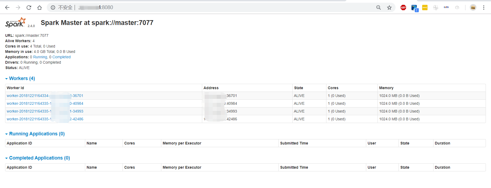

# Spark全分布式安装


## 目录

> - [安装Scala](#1)
> - [安装Spark](#2)
> - [启动Spark](#3)
> - []()

## <p id='1'>安装Scala

spark依赖scala，这里首先安装scala。

### 下载并解压

从[官网](https://www.scala-lang.org/download/)下载`scala-2.12.8.tgz`，并使用`scp  scala-2.12.8.tgz root@hadoop_xgm:`上传到阿里云。在master端，使用`tar -zvxf /root/scala-2.12.8.tgz -C /opt/`命令解压tgz文件到相应目录。

### 配置环境变量

直接执行以下命令即可
```
echo 'export SCALA_HOME=/opt/scala-2.12.8' >> /etc/bash.bashrc ;
echo 'export PATH=$SCALA_HOME/bin:$PATH' >> /etc/bash.bashrc ;
source /etc/bash.bashrc;
```
直接输入`scala`，如果成功则输出如下。安装过程非常简单
```
root@master:/opt# scala
Welcome to Scala 2.12.8 (OpenJDK 64-Bit Server VM, Java 1.8.0_191).
Type in expressions for evaluation. Or try :help.

scala> 1+1
res0: Int = 2
```

### 给每个slave安装

同理，在master端，使用`scp /root/scala-2.12.8.tgz root@slave1:`拷贝文件，然后分别进入每一台slave执行以下命令
```
tar -zvxf /root/scala-2.12.8.tgz -C /opt/ ;
echo 'export SCALA_HOME=/opt/scala-2.12.8 ' >> /etc/bash.bashrc ;
echo 'export PATH=$SCALA_HOME/bin:$PATH ' >> /etc/bash.bashrc ;
source /etc/bash.bashrc;
```
即可完成安装。  

值得注意的是，echo函数后可以跟上单引号和双引号，关于单引号和双引号，区别只有一个，单引号里的变量和运算符不会被解释。原样输出。而双引号里的会解释为相应的内容。这里显然应使用单引号。  


## <p id='2'>安装Spark


### 下载并解压

从[官网](http://spark.apache.org/downloads.html)下载`spark-2.4.0-bin-hadoop2.7.tgz`，并使用`scp  spark-2.4.0-bin-hadoop2.7.tgz root@hadoop_xgm:`上传到阿里云。在master端，使用`tar -zvxf /root/spark-2.4.0-bin-hadoop2.7.tgz -C /opt/`命令解压tgz文件到相应目录。这里重命名一下，`mv /opt/spark-2.4.0-bin-hadoop2.7/ /opt/spark-2.4.0`  

### 配置环境变量

直接粘贴复制执行以下命令即可
```
echo 'export SPARK_HOME=/opt/spark-2.4.0' >> /etc/bash.bashrc ;
echo 'export PATH=PATH=$SPARK_HOME/bin:$SPARK_HOME/sbin:$PATH' >> /etc/bash.bashrc ;
source /etc/bash.bashrc;
```

### 配置spark-env.sh文件

同样直接整段copy执行即可。
```
echo 'export JAVA_HOME=$JAVA_HOME ' >> /opt/spark-2.4.0/conf/spark-env.sh;
echo 'export HADOOP_HOOME=$HADOOP_HOOME' >> /opt/spark-2.4.0/conf/spark-env.sh;
echo 'export HADOOP_CONF_DIR=$HADOOP_CONF_DIR' >> /opt/spark-2.4.0/conf/spark-env.sh;
echo 'export SCALA_HOME=$SCALA_HOME' >> /opt/spark-2.4.0/conf/spark-env.sh;

rm /opt/spark-2.4.0/conf/spark-env.sh;
touch /opt/spark-2.4.0/conf/spark-env.sh;
echo 'export SPARK_MASTER_HOST=master' >> /opt/spark-2.4.0/conf/spark-env.sh;
echo 'export SPARK_MASTER_PORT=7077' >> /opt/spark-2.4.0/conf/spark-env.sh;
echo 'export SPARK_WORKER_CORES=1' >> /opt/spark-2.4.0/conf/spark-env.sh;
echo 'export SPARK_WORKER_MEMORY=1G' >> /opt/spark-2.4.0/conf/spark-env.sh;

```

### 配置slaves文件

整段copy执行
```
touch /opt/spark-2.4.0/conf/slaves;
echo 'slave1' >> /opt/spark-2.4.0/conf/slaves;
echo 'slave2' >> /opt/spark-2.4.0/conf/slaves;
echo 'slave3' >> /opt/spark-2.4.0/conf/slaves;
echo 'slave4' >> /opt/spark-2.4.0/conf/slaves;
```


### 给每个slave安装

在master端，使用`scp /root/spark-2.4.0-bin-hadoop2.7.tgz root@slave1:`拷贝文件，然后分别进入每一台slave，将上面的命令重复一遍，即解压、配置环境变量、`spark-env.sh`和`slaves`。直接整段copy：
```
tar -zvxf /root/spark-2.4.0-bin-hadoop2.7.tgz -C /opt/;
mv /opt/spark-2.4.0-bin-hadoop2.7/ /opt/spark-2.4.0;

echo 'export SPARK_HOME=/opt/spark-2.4.0' >> /etc/bash.bashrc ;
echo 'export PATH=PATH=$SPARK_HOME/bin:$SPARK_HOME/sbin:$PATH' >> /etc/bash.bashrc ;
source /etc/bash.bashrc;

touch /opt/spark-2.4.0/conf/spark-env.sh;
echo 'export SPARK_MASTER_HOST=master' >> /opt/spark-2.4.0/conf/spark-env.sh;
echo 'export SPARK_MASTER_PORT=7077' >> /opt/spark-2.4.0/conf/spark-env.sh;
echo 'export SPARK_WORKER_CORES=1' >> /opt/spark-2.4.0/conf/spark-env.sh;
echo 'export SPARK_WORKER_MEMORY=1G' >> /opt/spark-2.4.0/conf/spark-env.sh;

touch /opt/spark-2.4.0/conf/slaves;
echo 'slave1' >> /opt/spark-2.4.0/conf/slaves;
echo 'slave2' >> /opt/spark-2.4.0/conf/slaves;
echo 'slave3' >> /opt/spark-2.4.0/conf/slaves;
echo 'slave4' >> /opt/spark-2.4.0/conf/slaves;
```

## <p id='3'>启动Spark

使用这里的启动命令和hadoop一样，我们需要进入目录并启动，具体如下
```
cd /opt/spark-2.4.0/sbin/;
./start-all.sh
```
成功后输出
```
root@master:/opt/spark-2.4.0/sbin# sh ./start-all.sh
starting org.apache.spark.deploy.master.Master, logging to /opt/spark-2.4.0/logs/spark-root-org.apache.spark.deploy.master.Master-1-master.out
slave4: starting org.apache.spark.deploy.worker.Worker, logging to /opt/spark-2.4.0/logs/spark-root-org.apache.spark.deploy.worker.Worker-1-slave4.out
slave3: starting org.apache.spark.deploy.worker.Worker, logging to /opt/spark-2.4.0/logs/spark-root-org.apache.spark.deploy.worker.Worker-1-slave3.out
slave2: starting org.apache.spark.deploy.worker.Worker, logging to /opt/spark-2.4.0/logs/spark-root-org.apache.spark.deploy.worker.Worker-1-slave2.out
slave1: starting org.apache.spark.deploy.worker.Worker, logging to /opt/spark-2.4.0/logs/spark-root-org.apache.spark.deploy.worker.Worker-1-slave1.out
```
此时我们能够在浏览器中直接访问`http://master:8080`能够看到spark的WEBUI：


## <p id='4'>运行SparkDEMO--SparkPi

尝试向集群提交[官网](https://spark.apache.org/docs/latest/running-on-yarn.html)提供的DEMO，这是一个计算π值的小程序，spark自带。

```
cd /opt/spark-2.4.0;
./bin/spark-submit --class org.apache.spark.examples.SparkPi \
    --master yarn \
    --deploy-mode cluster \
    --driver-memory 512mb \
    --executor-memory 512mb \
    --executor-cores 1 \
    --queue default \
    examples/jars/spark-examples*.jar \
    10
```
**注意**！这里的`--driver-memory 512mb`和`--executor-memory 512mb`需要根据YARN的配置情况设置。之前的文章中，将每个节点的可用内存设置为了1024mb。根据shell的报错信息，spark需要额外的384mb开销，所以对内存需求为512+384mb=896mb<1024mb。把两者都设置为512mb，就不会报错。

## Spark错误分析

停止集群命令：
```
cd /opt/spark-2.4.0/sbin;
./stop-all.sh;
```

## WARN--NativeCodeLoader:62

控制台输出如下
```
WARN  NativeCodeLoader:62 - Unable to load native-hadoop library for your platform... using builtin-java classes where applicable
```


### WARN--Client:66

控制台输出如下
```
WARN  Client:66 - Neither spark.yarn.jars nor spark.yarn.archive is set, falling back to uploading libraries under SPARK_HOME.
```

这里会卡住很久

hdfs dfs -mkdir -p /conf_files/spark_jars;

hdfs dfs -put /opt/spark-2.4.0/examples/jars/* /conf_files/spark_jars/;


cp /opt/spark-2.4.0/conf/spark-defaults.conf.template /opt/spark-2.4.0/conf/spark-defaults.conf;

echo 'spark.yarn.jars=hdfs://master:9000/conf_files/spark_jars/*' >> /opt/spark-2.4.0/conf/spark-defaults.conf;

echo 'export LD_LIBRARY_PATH=$HADOOP_HOME/lib/native' >> /etc/bash.bashrc;
source /etc/bash.bashrc

cd /opt/spark-2.4.0/sbin/;
./start-all.sh;
