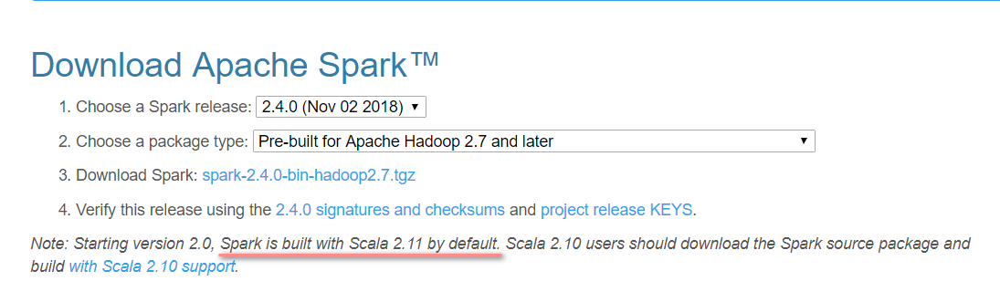
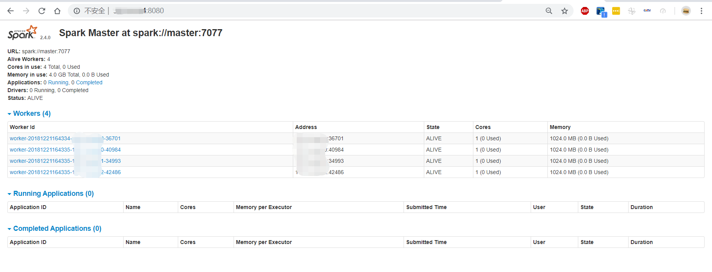

# Spark分布式环境搭建

这里基于hadoop分布式环境，继续搭建spark。

## 目录

> - [安装Scala](#1)
> - [安装Spark](#2)
> - [启动Spark](#3)
> - [运行SparkDEMO--SparkPi](#4)
> - [Spark错误分析](#5)

## <p id='1'>安装Scala

spark依赖scala，这里首先安装scala。

### 下载并解压

从[官网](https://www.scala-lang.org/download/)下载`scala-2.11.12.tgz`并解压tgz文件到相应目录。
```
cd /root/xiazai;
rm -rf /opt/scala-2.12.8
wget https://downloads.lightbend.com/scala/2.11.12/scala-2.11.12.tgz;
tar -zvxf /root/xiazai/scala-2.11.12.tgz -C /opt/;
```

**特别注意**，这里的scala版本和spark版本之间存在对应关系，[官网](http://spark.apache.org/downloads.html)会给出，如下图。

### 配置环境变量

直接执行以下命令即可
```
echo '
# SCALA SETTINGS
export SCALA_HOME=/opt/scala-2.11.12
export PATH=$SCALA_HOME/bin:$PATH
' >> /etc/bash.bashrc ;
source /etc/bash.bashrc;
scala -version
```
可以看到如下输出
```bash
root@master:~/xiazai# scala -version
Scala code runner version 2.11.12 -- Copyright 2002-2017, LAMP/EPFL
``` 

值得注意的是，echo函数后可以跟上单引号和双引号，关于单引号和双引号，区别只有一个，单引号里的变量和运算符不会被解释。原样输出。而双引号里的会解释为相应的内容。这里显然应使用单引号。  


## <p id='2'>安装Spark


### 下载并解压

从[官网](http://spark.apache.org/downloads.html)下载、解压。
```
cd /root/xiazai;
wget http://mirrors.hust.edu.cn/apache/spark/spark-2.4.0/spark-2.4.0-bin-hadoop2.7.tgz;
tar -zvxf spark-2.4.0-bin-hadoop2.7.tgz -C /opt/;
mv /opt/spark-2.4.0-bin-hadoop2.7 /opt/spark-2.4.0;
```

### 配置环境变量

直接粘贴复制执行以下命令即可
```
echo '
# SPARK SETTINGS
export SPARK_HOME=/opt/spark-2.4.0
export PATH=$SPARK_HOME/bin:$SPARK_HOME/sbin:$PATH
' >> /etc/bash.bashrc ;
source /etc/bash.bashrc;
```

### 配置spark-env.sh、spark-config.sh

同样直接整段copy执行即可。
```
rm /opt/spark-2.4.0/conf/spark-env.sh;
touch /opt/spark-2.4.0/conf/spark-env.sh;

echo '
export JAVA_HOME=$JAVA_HOME 
export HADOOP_HOOME=$HADOOP_HOOME
export HADOOP_CONF_DIR=$HADOOP_CONF_DIR
export SCALA_HOME=$SCALA_HOME

export SPARK_MASTER_HOST=master
export SPARK_MASTER_PORT=7077
export SPARK_WORKER_CORES=1
export SPARK_WORKER_MEMORY=1G
' > /opt/spark-2.4.0/conf/spark-env.sh;

echo "
export JAVA_HOME=$JAVA_HOME
export LD_LIBRARY_PATH=$HADOOP_HOME/lib/native
" >> /opt/spark-2.4.0/sbin/spark-config.sh;
```


### 配置slaves文件

整段copy执行
```
rm /opt/spark-2.4.0/conf/slaves;
touch /opt/spark-2.4.0/conf/slaves;
echo 'slave1
slave2
slave3
'> /opt/spark-2.4.0/conf/slaves;
```


### 分发

整个文件夹分发给slaves
```
scp -r /opt/spark-2.4.0 root@slave1:/opt/;
scp -r /opt/spark-2.4.0 root@slave2:/opt/;
scp -r /opt/spark-2.4.0 root@slave3:/opt/;
ls
```

分别进入每一台slave配置环境变量，直接整段copy：
```
echo '
# SPARK SETTINGS
export SPARK_HOME=/opt/spark-2.4.0
export PATH=$SPARK_HOME/bin:$SPARK_HOME/sbin:$PATH
' >> /etc/bash.bashrc ;
source /etc/bash.bashrc;
exit
```

## <p id='3'>启动Spark

使用这里的启动命令和hadoop一样，我们需要进入目录并启动，具体如下
```
$SPARK_HOME/sbin/start-all.sh
```
成功后输出
```bash
root@master:/opt/spark-2.4.0/sbin# sh ./start-all.sh
starting org.apache.spark.deploy.master.Master, logging to /opt/spark-2.4.0/logs/spark-root-org.apache.spark.deploy.master.Master-1-master.out
slave3: starting org.apache.spark.deploy.worker.Worker, logging to /opt/spark-2.4.0/logs/spark-root-org.apache.spark.deploy.worker.Worker-1-slave3.out
slave2: starting org.apache.spark.deploy.worker.Worker, logging to /opt/spark-2.4.0/logs/spark-root-org.apache.spark.deploy.worker.Worker-1-slave2.out
slave1: starting org.apache.spark.deploy.worker.Worker, logging to /opt/spark-2.4.0/logs/spark-root-org.apache.spark.deploy.worker.Worker-1-slave1.out
```
此时我们能够在浏览器中直接访问`http://master:8080`能够看到spark的WEBUI：


## <p id='4'>运行SparkDEMO--SparkPi

尝试以YARN模式向集群提交[官网](https://spark.apache.org/docs/latest/running-on-yarn.html)提供的DEMO，这是一个计算π值的小程序，spark自带。

```
$SPARK_HOME/bin/spark-submit --class org.apache.spark.examples.SparkPi \
    --master yarn \
    --deploy-mode cluster \
    --driver-memory 512mb \
    --executor-memory 512mb \
    --executor-cores 1 \
    --queue default \
    $SPARK_HOME/examples/jars/spark-examples*.jar \
    10
```
**注意**！这里的`--driver-memory 512mb`和`--executor-memory 512mb`需要根据YARN的配置情况设置。之前的文章中，将每个节点的可用内存设置为了1024mb。根据shell的报错信息，spark需要额外的384mb开销，所以对内存需求为512+384mb=896mb < 1024mb。把两者都设置为512mb，就不会报错。  

打开hadoop的界面能够看到application，因为这里是提交到YARN运行，所以在spark自己的界面是看不到的。

## <p id='5'>Spark错误分析

笔者遇到的问题极少，只有两个warn。  

停止集群命令：
```
$SPARK_HOME/sbin/stop-all.sh;
```

### WARN--NativeCodeLoader:62

控制台输出如下
```
WARN  NativeCodeLoader:62 - Unable to load native-hadoop library for your platform... using builtin-java classes where applicable
```
在spark的sbin目录下，在spark-config文件中加入LD_LIBRARY_PATH环境变量LD_LIBRARY_PATH=$HADOOP_HOME/lib/native
```
echo 'export LD_LIBRARY_PATH=$HADOOP_HOME/lib/native' >> /opt/spark-2.4.0/sbin/spark-config.sh;
```


### WARN--Client:66

控制台输出如下
```
WARN  Client:66 - Neither spark.yarn.jars nor spark.yarn.archive is set, falling back to uploading libraries under SPARK_HOME.
```
如果卡住很久没动，并且hadoop的webUI主界面能够显示接受到任务，直接failed，那么很有可能的情况是spark和yarn连接出现了问题。
