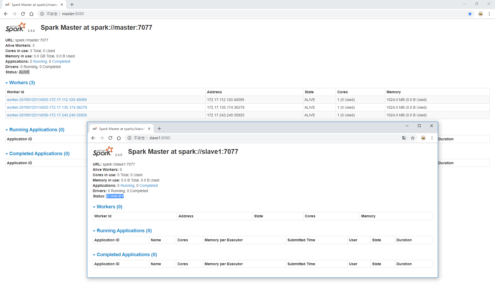

# Spark分布式HA模式搭建

建议在搭建并成功运行spark非HA模式DEMO的情况下，再阅读本文。相关文档可以[点击这里](./Spark_distribute.md)。

本文同样要求配置并启动zookeeper集群，在[hadoop HA模式搭建](./Hadoop_distribute_HA.md)的文章中有详细记录。

## 目录

- [更改配置文件](#1)
- [启动](#2)


## <p id=1>更改配置文件

这里令master为主节点，slave1为备用节点。

先停止集群。
```
$SPARK_HOME/sbin/stop-all.sh
```

master上执行如下。只需要把spark-env.sh注释掉一行，增加一行即可。
```
rm /opt/spark-2.4.0/conf/spark-env.sh;
touch /opt/spark-2.4.0/conf/spark-env.sh;

echo '
export JAVA_HOME=$JAVA_HOME 
export HADOOP_HOOME=$HADOOP_HOOME
export HADOOP_CONF_DIR=$HADOOP_CONF_DIR
export SCALA_HOME=$SCALA_HOME

# export SPARK_MASTER_HOST=master
export SPARK_MASTER_PORT=7077
export SPARK_WORKER_CORES=1
export SPARK_WORKER_MEMORY=1G

# HA SETTINGS
export SPARK_DAEMON_JAVA_OPTS="-Dspark.deploy.recoveryMode=ZOOKEEPER -Dspark.deploy.zookeeper.url=master:2181,slave1:2181,slave2:2181,slave3:2181"
' > /opt/spark-2.4.0/conf/spark-env.sh;
scp /opt/spark-2.4.0/conf/spark-env.sh root@slave1:/opt/spark-2.4.0/conf/;
scp /opt/spark-2.4.0/conf/spark-env.sh root@slave2:/opt/spark-2.4.0/conf/;
scp /opt/spark-2.4.0/conf/spark-env.sh root@slave3:/opt/spark-2.4.0/conf/;
```

## <p id=2>启动

master上启动
```
$SPARK_HOME/sbin/start-all.sh
```

slave1上启动

ssh root@slave1
```
$SPARK_HOME/sbin/start-master.sh;
exit
```
打开`http://master:8080/`和`http://slave1:8080/`可以状态分别为`ALIVE`和`STANDBY`


