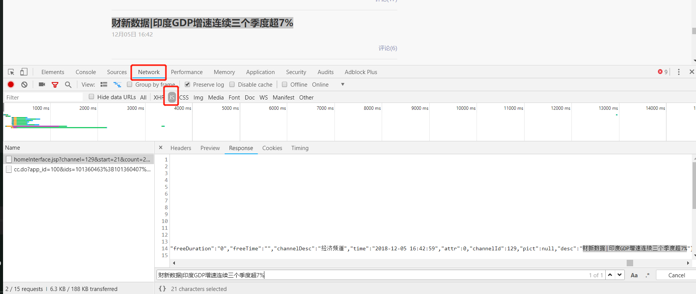

# Python+MongoDB————爬取与存储数据

由于阿里云学生机配置太差，这里使用本地计算机编写爬虫并存储，之后再只用分布式系统进行存储与分析。  

本文打算爬取[财新网](http://www.caixin.com/)的文章。

##目录

> - [获取目标url]()
> - [从url获取数据]()
> - [清理数据]()
> - [DEMO]()
> - [上传到分布式MongoDB]()
> - []()
> - []()

## 获取目标url

首先，我们需要观察网页结构，确定爬取目标。点击[经济](http://economy.caixin.com/)按钮可以进入经济新闻相关的文章列表，往下滑，出现`加载更多文章`按钮。这很明显是ajax加载。ajax是一种异步加载机制，只有点击网页元素，才会向服务器发送request，获得response之后添加到当前的网页，以实现动态加载网页的目的。  

面对ajax的机制，首先要做的就是使用按下`F12`，点击`Network`，进入浏览器的控制台抓包，这里使用的是chrome浏览器。先打开控制台，再点击“加载更多文章”按钮，即可看到控制台有了相应输出。然后点击`JS`，即设置过滤器为JSON格式，即可看到相应数据包，如下图。



可以发现，这是非常规整的josn格式数据。点击`Headers`即可看到相应的Request URL，这里是`http://tag.caixin.com/news/homeInterface.jsp?channel=129&start=21&count=21&picdim=_145_97&callback=jQuery17203729076279107504_1545182543901&_=1545183065166`。可以看到，url含有channer、start、count等参数。很显然，channel代表的是“经济”栏目，start表示起点位置，count表示请求个数。为了一次性获取更多urls，我们改变参数试试。经过一系列测试，可以知道，一次的count值最大为122。即：
```
http://tag.caixin.com/news/homeInterface.jsp?channel=129&start=0&count=122&picdim=_145_97&callback=jQuery17203729076279107504_1545182543901&_=1545183065166
```
到这里，我们可以开始构建Python程序，获取相应url。代码可见本目录下的[Caixin_GetUrls.py](./Caixin_GetUrls.py)

### Caixin_GetUrls.py思路简介

打开财新网，我们可以看到首页有“经济”、“金融”、“公司”、“政经”、“环科”、“世界”、“观点网”这7个子栏目，分别点进去，我们可以看到网页的结构非常相似，最低端可以点击“加载更多文章”按钮，向服务器请求JSON。经过上述的分析，我们可以得出如下的channel和栏目之间的对应关系：
```
129:economy——经济
125:finance——金融
130:companies——公司
131:china——政经
179:science——环科
132:international——世界  
126:opinion——观点网
```
更有意思的是，不同的channel之间，请求JSON的URL格式是一样的，都采用GET方式请求数据。这样可以大幅降低我们的编程复杂度。

源码中的`fetchJSON()`方法即为主要实现方法，通过构造带headers的request，我们可以直接将一个json保存为一个文件，每个json中含有100个链接，经过测试，最多能够获取每个channel的1000个链接。  

关于如何构造header，其实也很简单。打开浏览器的控制台，在network下找到相应的请求，点击request就能看到我们发送的header是什么。  

源码中的`yield_file_from_filefold()`方法是一个迭代器，使用yield关键字，本方法返回的是指定目录下的含有`pattern`关键字的的文件名。例如，输入`129`，那么该方法产生一个迭代器，可以遍历例如`caixin_129_xxxx.txt`的文件。  

总体来说，比较简单。  

这里简单展示一下财新网是如何表示一个网页的。很显然，其中的tid是唯一标识符。
```json
{
    "datas": [
        {
            "tags": [],
            "comm": {
                "tid": "101360772",
                "aid": "100"
            },
            "cate": "100300001;100300177;101360772",
            "desc": "不愿再当二股东 花旗亚洲拟售旧立新",
            "form": null,
            "channelId": 125,
            "nid": 101360772,
            "link": "http://finance.caixin.com/2018-12-19/101360772.html",
            "edit": {
                "rank": "",
                "desc": "",
                "name": "记者 张榆",
                "link": "",
                "head": ""
            },
            "attr": 5,
            "freeDuration": "0",
            "type": 0,
            "subDesc": "要闻",
            "channelDesc": "金融频道",
            "pict": {
                "imgs": [
                    {
                        "url": "http://img.caixin.com/2018-12-19/1545178263407838_145_97.jpg",
                        "txt": ""
                    }
                ],
                "num": 1
            },
            "audioUrl": "http://audio.caixin.com/caixin/772/101360772.mp3",
            "time": "2018-12-19 07:13:41",
            "freeTime": "",
            "video": "",
            "summ": "花旗亚洲计划将所持33.3%东方花旗证券股权转让给大股东东方证券"
        },
        {
            "tags": []
        }
    ]
}
```


## 从url获取数据

获得了json文件之后，我们只要使用python自带的json包就能极快地遍历需要的链接。  

我们通过分析network中的数据包，可以得到每一篇文章的具体获得URL，即
```
http://gateway.caixin.com/api/newauth/checkAuthByIdJsonp?callback=jQuery172038107031974088157_1545204262982&type=0&id=101354516&page=1
```
其中的id，就是我们上文中获取的tid！于是，我们只要遍历所有的tid并构造URL，就能访问所有的JSON。

### Caixin_Crawerls.py思路简介

这里的代码更加简单...只有不到100行。主要的原因在于这里获取文章的方式太简单了。  

源码中的`start_with_channel()`方法接受一个数字，即channel。然后遍历相应的json文件，并生成urllist。同样将获取的结果写入文件。  

为了提高效率，这里使用了4个线程同时进行，即`multi_process_strat()`方法，同样也是非常简单。  


## 清理数据

打开爬取的文本文件，我们可以看到，其中html标签非常多，这里使用很简单的方法去掉它们。例如
```
/**/jQuery172038107031974088157_1545204262982({"code":0,"data":"resetContentInfo({\"content\":\"<P>　　<B>【财新网】（记者 董兢）</B>转型两年半，<A href=\\\"http://search.caixin.com/search/%E6%96%B0%E5%8D%8E%E4%BF%9D%E9%99%A9.html\\\" target=\\\"_blank\\\">新华保险</A>（01336.HK，）成果逐渐清晰——上半年，新华保险续期保费占比79.19%，其依靠续期拉动保费发展的模式基本显现。</P><P>　　“一家寿险公司如果成长了十年，首年期交保费还占了60%-80%，这个公司仍然是新公司，仍然处在创业阶段。如果续期占了60%-70%，这才是成熟公司。”8月29日，新华保险董事长<A href=\\\"http://search.caixin.com/search/%E4%B8%87%E5%B3%B0.html\\\" target=\\\"_blank\\\">万峰</A>在中期业绩发布会上如是说。</P><P>　　保险公司保费包括新单保费和续期保费，新单保费包括趸交保费和首年期交保费。其中，趸交保费虽可使保险公司快速形成业务规模，但对持续发展没有帮助，也会造成长期经营的瓶颈；续期保费则具有滚存性，利于险企的可持续发展。</P><P>　　半年报显示，上半年新华保险实现保费收入678.70亿元，同比增长10.8%，其中首年保费141.22亿元，同比下降26.1%，续期保费537.48亿元，同比增长27.6%，占比分别为20.8%，79.21%。</P><P>　　新华保险的续期拉动保费转型始于2015年。为做大续期拉动保费规模，新华保险此前连续两年主动舍弃趸交保费，不对趸交保费业务下达要求。至今年上半年，新华保险的678亿元总保费收入中，趸交保费仅有29.05亿元，占比4.28%。</P><P>　　转型带动新华保险上半年的内含价值提升。半年报显示，上半年新华保险内含价值为1656.01亿元，同比提升7.9%；新业务价值尽管同比下降8.9%，但降幅仍优于同业。在净利润上，上半年，新华保险实现归属母公司利润57.99亿元，同比增长79.1%。</P><P>　　不过，对于下半年新业务价值增速能否转正，万峰表示，价值增长的根本在于保费增长，但由于当前市场环境不乐观，且重疾险消费需要一单单卖，消费难度大，新业务价值很难有跨越式增长。</P><P>　　在代理人队伍上，上半年新华保险个险渠道规模人力达33.4万人，同比增长0.3%；月均举绩人力17.1万人，同比增长2.6%；月均举绩53.6%，同比提升0.5个百分点；月均人均综合产能5187元，同比下降26.2%。</P><P>　　8月29日，新华保险港股收报36.6港元/股，涨幅1.95%；<A href=\\\"http://search.caixin.com/search/A%E8%82%A1.html\\\" target=\\\"_blank\\\">A股</A>收报46.92元/股，涨幅0.04%。■</P><P>　　[财新传媒新近在微信平台推出实验性单品“我闻”/“金融人·事”，对金融圈有更多垂直报道。可点此<A href=\\\"https://appc0zlouli8646.h5.xiaoeknow.com/homepage\\\" target=\\\"_blank\\\">订阅</A>。]</P>\",\"fromchannel\":\"16,22\",\"haveAuth\":\"NOVEL-CL,QZSF\",\"ispro\":0,\"media\":1,\"page\":1,\"status\":3,\"totalPage\":0})"});
```
可以使用Python正则表达式达到目的，相关教程一搜一大把。这里参考网络资料，简单整理成`Remove_html.py`文件。

## DEMO

本目录下提供了少量的数据作为demo，感兴趣的读者可以看看。